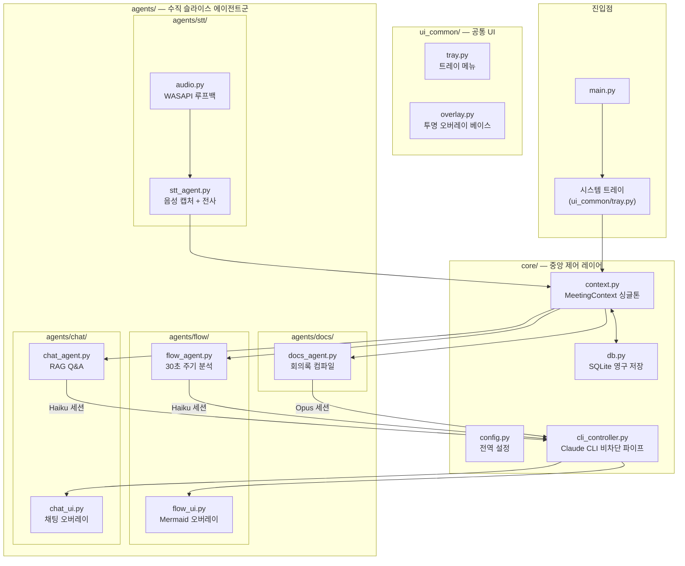

# PrismFlow 최종 구현 계획서

> 본 문서는 PrismFlow 프로젝트의 **유일한 정본(Single Source of Truth)** 계획서입니다.
> 프로젝트 디렉토리 내 `docs/implementation_plan.md`는 이 문서의 미러(Mirror)이며,
> Phase 작업 진입 전 양쪽을 동기화하여 관리합니다.

---

## 1. 프로젝트 정의

**PrismFlow**는 Windows 시스템 트레이에 상주하면서, 로컬 디바이스에서 회의 음성을 실시간 감지·녹음·전사(STT)하고, 4개의 독립 AI 에이전트(STT · Flow · Chat · Docs)가 유기적으로 협업하여 회의 흐름 시각화, 맥락 기반 Q&A, 최종 회의록 생성을 수행하는 **차세대 AI 회의 어시스턴트**입니다.

### 핵심 제약 조건
- **On-Device 영역 (외부 네트워크 불필요)**
  - STT 음성 인식 및 화자 분리: `faster-whisper` + `pyannote.audio` 로컬 실행
  - PySide6 UI 프로그램 전체 운영: 시스템 트레이, 투명 오버레이, QWebEngineView
- **Claude CLI 경유 영역 (로컬 CLI가 Anthropic 서버와 통신)**
  - Flow Agent: 회의 흐름 Mermaid 구조도 생성 (Haiku)
  - Chat Agent: 맥락 기반 실시간 Q&A (Haiku)
  - Docs Agent: 최종 회의록 Markdown 생성 (Opus)
  - ※ 외부 REST API를 직접 호출하지 않고, 로컬에 설치된 `claude` CLI를 `subprocess.Popen` 파이프로 제어
- **하드웨어 가속 (STT 전용, 자동 감지)**
  - Windows 11 고정 — OS 호환성 보장
  - 사용자 하드웨어 환경이 다를 수 있으므로 프로그램 기동 시 **자동 감지 순서**를 적용:
    1. NVIDIA GPU 감지 → CUDA(float16/int8) 가속
    2. Intel GPU/NPU 감지 → OpenVINO 가속
    3. 위 둘 다 없을 경우 → **CPU 폴백** (속도는 느리지만 반드시 동작 보장)
  - 설정 화면에서 사용자가 수동으로 가속 방식을 오버라이드할 수 있음
- **UI 프레임워크** — PySide6 (투명 오버레이 + QWebEngineView)

---

## 2. 확정된 설계 결정 사항

### 2-1. 시각화 엔진: Mermaid.js + QWebEngineView (로컬 번들링)

| 항목 | 내용 |
|:---|:---|
| **선택** | Mermaid.js를 `QWebEngineView`에서 렌더링 |
| **이유** | CSS 기반 Glassmorphism 스타일링 자유도, 자동 레이아웃 엔진 |
| **오프라인 보장** | `mermaid.min.js`를 프로젝트 내부 `resources/`에 로컬 파일로 패키징 |

### 2-2. Claude CLI 세션 분리 및 컨텍스트 병합

| 세션 | 모델 | 역할 | 컨텍스트 전략 |
|:---|:---|:---|:---|
| **Flow 세션** | Haiku | 30초 주기 Mermaid 구조도 생성 | 누적 발화 전체를 슬라이딩 윈도우로 추출 |
| **Chat 세션** | Haiku | 사용자 Q&A 즉시 응답 | 최근 10분 발화 원본 + Flow 요약 + 현재 Mermaid 코드 결합 |
| **Docs 세션** | Opus | 회의 종료 시 최종 보고서 | 전체 STT 원본 + 최종 Flow + Chat 이력 통합 |

- **통신 방식**: `subprocess.Popen` 상주 세션 + 백그라운드 스레드 + `queue.Queue` 비차단 I/O
- Flow와 Chat은 **별도 프로세스**로 완전 분리하여 스레드 데드락 방지

### 2-3. STT 및 화자 분리

- 설정 화면에서 Whisper 모델 크기(base/medium/large) 및 가속(CUDA/OpenVINO/CPU) 선택
- 모델 미존재 시 다운로드 상태바 제공
- **개발용 Mock 모드**: 15~20초 주기로 가상 다자 대화 자동 주입 (토글)

### 2-4. 최종 보고서 저장

- 저장 경로: `%USERPROFILE%\Documents\PrismFlow\YYYY-MM-DD\`
- 포맷: Markdown (회의 요약 + 의제별 쟁점 + 결정 사항 + Todo + Mermaid 소스 포함)
- 저장 후 Windows 기본 연결 프로그램으로 자동 실행

---

## 3. 시스템 아키텍처



---

## 4. 프로젝트 트리 구조

```text
E:\Tak\Gemini\PrismFlow\
│
│   ── 프로젝트 관리 ──────────────────────────────────────────
├── agent.md                        # AI 내비게이션: 읽기 순서, 수정 위치 안내, 코딩 규칙
├── main.py                         # 앱 진입점: QApplication 생성, 트레이 기동, 에이전트 오케스트레이션
├── run.bat                         # Windows 원클릭 실행 (가상환경 활성화 + python main.py)
│
│   ── 산출물 문서 ─────────────────────────────────────────────
├── docs/
│   ├── implementation_plan.md      # Phase 진입 전 업데이트하는 상세 구현 설계서
│   ├── task.md                     # Phase 진행 중/완료 후 업데이트하는 진행률 상태판
│   └── history.md                  # Phase 완료 시 작성하는 시행착오 및 의사결정 위키 스토리
│
│   ── ReAct 검증 ──────────────────────────────────────────────
├── tests/
│   ├── __init__.py
│   ├── conftest.py                 # 공통 피스처: 임시 DB, Mock CLI, QApplication 인스턴스
│   ├── test_core.py                # config / context 싱글톤 스레드 세이프티 검증
│   ├── test_db.py                  # SQLite 스키마 생성, CRUD, 세션 복원 테스트
│   ├── test_cli.py                 # Claude CLI 파이프 비차단 I/O, 타임아웃, 데드락 검증
│   ├── test_stt.py                 # Mock 발화 스트림 → MeetingContext 파이프라인 검증
│   ├── test_flow.py                # Mermaid 코드 파싱, 노드 재사용(Upsert) 유효성 검사
│   ├── test_chat.py                # RAG 컨텍스트 조립 (10분 발화 + Flow 요약 + Mermaid) 검증
│   └── test_docs.py                # Markdown 최종 리포트 생성 및 파일 I/O 검증
│
│   ── 메인 패키지 ─────────────────────────────────────────────
└── prismflow/
    ├── __init__.py
    │
    ├── core/                       # ■ 중앙 제어 레이어 (모든 에이전트가 의존)
    │   ├── __init__.py
    │   ├── config.py               #   전역 환경설정 (경로, 모델, 가속, 윈도우 기본값)
    │   ├── context.py              #   Thread-safe MeetingContext 싱글톤 + Qt Signal 방출
    │   ├── db.py                   #   SQLite 연결, 스키마 마이그레이션, 세션/발화/채팅 CRUD
    │   └── cli_controller.py       #   Claude CLI Popen 래퍼: 세션 생성, 비차단 읽기, 모델 지정
    │
    ├── ui_common/                  # ■ 공유 UI 컴포넌트
    │   ├── __init__.py
    │   ├── tray.py                 #   시스템 트레이 아이콘 + 우클릭 메뉴 (회의 시작/종료/설정/종료)
    │   └── overlay.py              #   투명 오버레이 베이스: FramelessHint, 호버 페이드, 드래그 이동
    │
    └── agents/                     # ■ 수직 슬라이스 에이전트 (각 폴더가 독립 기능 단위)
        │
        ├── stt/                    # ① STT 에이전트 슬라이스
        │   ├── __init__.py
        │   ├── stt_agent.py        #   QThread: VAD 청크 → faster-whisper 전사 → context 적재
        │   └── audio.py            #   sounddevice / WASAPI 루프백 캡처 유틸
        │
        ├── flow/                   # ② Flow 시각화 에이전트 슬라이스
        │   ├── __init__.py
        │   ├── flow_agent.py       #   QThread: 30초 슬라이딩 윈도우 → Claude Haiku → Mermaid 코드
        │   ├── flow_ui.py          #   QWebEngineView 투명 오버레이 (overlay.py 상속)
        │   ├── mermaid_html.py     #   로컬 js 임베드 HTML 템플릿 생성기
        │   └── resources/
        │       └── mermaid.min.js  #   오프라인용 로컬 번들 Mermaid.js 라이브러리
        │
        ├── chat/                   # ③ Chat 어시스턴트 에이전트 슬라이스
        │   ├── __init__.py
        │   ├── chat_agent.py       #   QThread: RAG 컨텍스트 조립 → Claude Haiku → 스트리밍 응답
        │   └── chat_ui.py          #   입력창 + 대화 히스토리 투명 오버레이 (overlay.py 상속)
        │
        └── docs/                   # ④ Docs 보고서 에이전트 슬라이스
            ├── __init__.py
            └── docs_agent.py       #   Claude Opus → Markdown 컴파일 → 파일 저장 → 자동 실행
```

---

## 5. Phase별 개발 계획 및 ReAct 검증

### Phase 1: Core 인프라 + 시스템 트레이 + 투명 오버레이 GUI

#### 개발 범위
| 대상 파일 | 작업 내용 |
|:---|:---|
| `prismflow/core/config.py` | 전역 설정 클래스 정의 (경로, 모델 크기, 가속 방식, UI 기본값) |
| `prismflow/core/context.py` | `MeetingContext` 싱글톤 뼈대 — 스레드 Lock + Qt Signal 정의 |
| `prismflow/ui_common/overlay.py` | 투명 오버레이 베이스 윈도우 (FramelessHint, 호버 페이드 애니메이션, 드래그 이동) |
| `prismflow/ui_common/tray.py` | 시스템 트레이 아이콘 + 메뉴 (회의 시작/종료/대시보드/설정/종료) |
| `main.py` | QApplication 생성 → 트레이 기동 → 오버레이 인스턴스 테스트 |
| `tests/conftest.py` | QApplication 피스처, 임시 설정 경로 |
| `tests/test_core.py` | config 로드, context 싱글톤 스레드 세이프티 |

#### ReAct 검증
```bash
.venv\Scripts\python -m pytest tests/test_core.py -v
```

---

### Phase 2: SQLite DB + STT 실시간 엔진 & Mock 에뮬레이터 설계

#### 개발 범위
| 대상 파일 | 작업 내용 |
|:---|:---|
| `prismflow/core/db.py` | SQLite 연결, 스키마 생성 및 CRUD 구현 (시작/종료 시간 개별 필드 적용) |
| `prismflow/core/context.py` | DB 연동 확장 — 회의 시작/종료/발화 추가 시 DB에 실시간 저장 수행 |
| `prismflow/agents/stt/audio.py` | PyAudio 기반 마이크 오디오 실시간 캡처 유틸 (16000Hz, Mono, Float32, 링버퍼 적재 Lock 제어) |
| `prismflow/agents/stt/stt_agent.py` | `RealTimeEngineWorker` (QThread) 구현:<br/>1. OpenVINO GenAI 2025.0 Stateful Whisper 및 pyannote-openvino 실시간 추론 연동<br/>2. 가중치 미존재 시 안내 다이얼로그 처리<br/>3. Mock 모드: 가상 한국어 대화 큐를 통해 실제 엔진과 동일한 (start, end, speaker, text) 신호 주기적 방출 |
| `tests/test_db.py` | 스키마 자동 생성, 발화 및 세션 CRUD 검증 테스트 |
| `tests/test_stt.py` | STT 스레드 기동 후 실제 오디오 수집 버퍼 작동 및 Mock 모드 신호 발생 주기 검증 |

#### SQLite 테이블 상세 설계 (정밀화)
1. **회의 세션 (`meeting_sessions`)**:
   - `session_id` (TEXT, PK): timestamp 기반 ID (`YYYYMMDD_HHMMSS`)
   - `title` (TEXT): 회의 제목 (기본값: "새로운 회의")
   - `start_time` (TEXT): 회의 시작 일시 (ISO8601)
   - `end_time` (TEXT, NULLABLE): 회의 종료 일시 (ISO8601)
   - `summary` (TEXT, NULLABLE): 최종 요약 보고서 본문
2. **발화 데이터 (`transcripts`)**:
   - `id` (INTEGER, PK AUTOINCREMENT): 발화 순번
   - `session_id` (TEXT, FK): `meeting_sessions.session_id` 외래키
   - `speaker` (TEXT): 화자 식별자 (예: Speaker_00, Speaker_01 등)
   - `text` (TEXT): 전사된 대화 텍스트
   - `start_time` (REAL): 발화 시작 타임스탬프 (초)
   - `end_time` (REAL): 발화 종료 타임스탬프 (초)
3. **채팅 기록 데이터 (`chat_logs`)**:
   - `id` (INTEGER, PK AUTOINCREMENT): 채팅 로그 ID
   - `session_id` (TEXT, FK): `meeting_sessions.session_id` 외래키
   - `query` (TEXT): 사용자 질문 내용
   - `response` (TEXT): Claude CLI를 통해 전달받은 Q&A 답변 내용
   - `timestamp` (REAL): Q&A 시점 UNIX Epoch Timestamp
4. **애플리케이션 설정 (`settings`)**:
   - `key` (TEXT, PK): 설정 식별자 (예: `whisper_model_size`, `hardware_acceleration`, `vad_threshold` 등)
   - `value` (TEXT): 설정값

#### STT & Diarization 핵심 파이프라인 설계 규칙
* **오디오 표준 규격**: 샘플 레이트 `16000Hz`, 단일 채널(`Mono`), 데이터 타입 `Float32`
* **추론 윈도우 알고리즘**: 5.0초 분석 윈도우, 0.5초 시프트 슬라이딩 윈도우 적용
* **추론 파라미터 강제 제어**:
  - `condition_on_previous_text = False` (환각 누적 방지)
  - `language = "<|ko|>"` (언어 감지 생략, 약 50ms 지연 단축)
  - `word_timestamps = True` (정밀 타임라인 동기화)
  - Diarization: `duration = 5.0, step = 0.5, rho_update = 0.1`

#### ReAct 검증
```bash
.venv\Scripts\python -m pytest tests/test_db.py tests/test_stt.py -v
```

---

### Phase 3: Claude CLI 파이프 + Flow Agent + Mermaid 시각화 & 스마트 화면 융합

#### 개발 범위
| 대상 파일 | 작업 내용 |
|:---|:---|
| `prismflow/core/cli_controller.py` | Popen 래퍼: 세션 생성, 비차단 stdout 읽기, 모델 지정 (`--model`) |
| `prismflow/agents/flow/flow_agent.py` | 30초 슬라이딩 윈도우 → Claude Haiku 프롬프트 → Mermaid 코드 파싱<br/>- **Stateful Update**: 직전 Mermaid 코드를 함께 전송하여 기존 노드 구조 재사용(Upsert) 유도<br/>- **계층화/필터**: 대주제 서브그래프화, 잡담 노이즈 필터 및 흐름선 매핑 |
| `prismflow/agents/flow/flow_ui.py` | QWebEngineView 투명 오버레이 + 동적 Mermaid 렌더링 |
| `prismflow/agents/flow/mermaid_html.py` | 로컬 js 임베드 HTML 템플릿 생성기 |
| `prismflow/agents/flow/resources/mermaid.min.js` | 오프라인용 라이브러리 다운로드 배치 |
| `prismflow/core/screen_detector.py` [NEW] | **스마트 화면 맥락 감지**: PPT 슬라이드 감지(Office COM API) 및 범용 감지(32x32 초경량 픽셀 변화율 분석)<br/>- 30초 정착(Settled) 디바운스 및 가벼운 시각 지시어 매핑 적용 |
| `tests/test_cli.py` | 파이프 데드락 검증, 타임아웃 처리, 모델 전환 |
| `tests/test_flow.py` | Mermaid 코드 문법 유효성, 노드 재사용(Upsert) 검사, 화면 전환 이벤트 연계 검증 |

#### 상세 기술 설계 명세

##### 1. Claude CLI 비차단 통신 (`cli_controller.py`)
- **프로세스 관리**: `subprocess.Popen`을 활용하여 로컬 `claude` CLI를 기동하며, 표준 입력(`stdin`), 표준 출력(`stdout`), 표준 에러(`stderr`)를 모두 PIPE로 지정해 비차단 양방향 제어를 수행합니다.
- **백그라운드 비차단 큐 읽기**:
  - Windows의 파이프 대기 차단 문제를 회피하기 위해, 프로세스 기동 즉시 `stdout`과 `stderr`를 읽어내는 별도의 백그라운드 데몬 스레드를 실행합니다.
  - 읽어온 줄 바꿈 단위의 응답 데이터는 `queue.Queue`에 실시간으로 보관하여, 메인 스레드가 `get_nowait()` 또는 `get(timeout=...)` 형태로 대기 없이 안전하게 꺼내 갈 수 있도록 구현합니다.
- **세션 분리**: Flow 시각화 에이전트와 Chat 에이전트가 단일 CLI 상에서 명령어가 충돌하거나 락이 걸리지 않도록 각각의 Popen 프로세스를 격리된 별개의 세션 인스턴스로 분리 관리합니다.

##### 2. 오프라인 Mermaid 시각화 UI (`flow_ui.py`, `mermaid_html.py`)
- **오프라인 라이브러리 번들링**: 인터넷이 단절된 환경에서도 Mermaid 드로잉이 수행될 수 있도록 `mermaid.min.js`를 상대경로 리소스로 패키징하여 로드합니다.
- **HTML 템플릿 및 스타일링**:
  - `QWebEngineView`에 로드되는 기본 HTML 프레임에 다크 테마(Dark Mode HSL 컬러 팔레트) 및 반투명 유리 효과(Glassmorphism CSS)를 적용하여 심미성을 대폭 강화합니다.
- **동적 렌더링**:
  - 30초마다 새로운 Mermaid 코드 시그널이 도달하면 페이지를 새로고침(`reload`)하지 않고, QWebEngineView의 `page().runJavaScript()` API를 실행하여 자바스크립트 수준에서 `mermaid.render()` 함수를 동적으로 호출하여 깜빡임 없는 실시간 리렌더링을 구현합니다.

##### 3. Flow Agent 분석 루프 및 스마트 화면 맥락 융합 (`flow_agent.py`, `screen_detector.py`)
- **Stateful 점진적 다이어그램 업데이트**:
  - 매 30초마다 Claude Haiku로 텍스트 요약을 요청할 때, **`[기존 Mermaid 코드]`**를 프롬프트에 동시 전달합니다.
  - *"기존 노드들의 ID를 최대한 재사용(Upsert)하고 새로운 소주제 논의 사항은 꼬리에 덧붙여 나가라"*는 강한 제약을 주어 시각적 흐름의 연속성을 보존합니다.
- **회의 논리 계층화**:
  - 대주제는 Mermaid `subgraph`로 레이아웃을 묶어내며, 소소한 일상 잡담이나 추임새는 AI 프롬프트 필터링 정책에 의해 걸러집니다.
- **스마트 화면 감지기 (ScreenTransitionDetector)**:
  - **30초 정착(Settled) 디바운스**: 사용자가 슬라이드를 빠르게 훑는 동안은 캡처하지 않고, 화면 변화가 멈춘 지 최소 30초가 지나 완전히 고정(Settled) 되었을 때만 핵심 슬라이드로 인정하여 캡처 텍스트를 확정 큐에 넣습니다.
  - **파워포인트 전체화면 감지**: Windows COM 인터페이스를 이용해 PPT 슬라이드 쇼 윈도우의 `SlideIndex` 번호를 읽어 전환 시점을 100% 추적합니다.
  - **범용 화면 감지 폴백**: PPT가 아닐 경우 모니터 영역을 32x32 초소형 해상도로 주기적으로 캡처하고, 픽셀 변화율(MSE)이 임계값을 넘는 순간을 화면 이동으로 간주합니다.
  - **중복 전송 방지 (Deduplication)**:
    - PPT 화면: `ActivePresentation.Name` + `SlideIndex` 정보가 직전 확정 시점과 동일할 경우 분석 처리를 생략하고 패스(Skip)합니다.
    - 범용 화면: 32x32 초소형 캡처본의 **지각적 해시(pHash)**를 비교하여 직전 확정 해시와 유사(해밍 거리 2 이하)할 경우 캡처 및 OCR 전송을 생략하고 패스(Skip)합니다.
  - **시각 지시어 결합**: STT 발화 중 "여기 보시면", "이 슬라이드", "이 도표" 등 화면 지칭용 지시어가 가볍게 매칭되는 순간, 대기 중이던 확정 캡처 데이터를 결합하여 Claude CLI 측에 맥락 보조 자료로 제공합니다.

#### ReAct 검증
```bash
.venv\Scripts\python -m pytest tests/test_cli.py tests/test_flow.py -v
```

---

### Phase 4: Chat Agent + 하이브리드 RAG + 대화창 UI

#### 개발 범위
| 대상 파일 | 작업 내용 |
|:---|:---|
| `prismflow/agents/chat/chat_agent.py` | RAG 컨텍스트 조립 (10분 발화 + Flow 요약 + Mermaid) → Claude Haiku |
| `prismflow/agents/chat/chat_ui.py` | 입력창 + 스크롤 대화 히스토리 + 스트리밍 타이핑 효과 오버레이 |
| `tests/test_chat.py` | 모의 질문 → RAG 컨텍스트 정확도 검증, 응답 파싱 |

#### ReAct 검증
```bash
.venv\Scripts\python -m pytest tests/test_chat.py -v
```

---

### Phase 5: Docs Agent + 최종 보고서 + 통합 최적화

#### 개발 범위
| 대상 파일 | 작업 내용 |
|:---|:---|
| `prismflow/agents/docs/docs_agent.py` | 전체 STT + 최종 Flow + Chat 이력 → Claude Opus → Markdown 컴파일 |
| `run.bat` | 가상환경 활성화 + `python main.py` 원클릭 실행 |
| `tests/test_docs.py` | Markdown 리포트 생성 검증, 파일 저장 경로 확인 |

#### ReAct 검증
```bash
.venv\Scripts\python -m pytest tests/test_docs.py -v
```

---

## 6. AI 바이브 코딩 문서 체계 및 운영 규칙

| 문서 | 위치 | 업데이트 시점 | 역할 |
|:---|:---|:---|:---|
| **agent.md** | 프로젝트 루트 | 트리 구조 변경 시 상시 | AI가 어디를 읽고 어디를 고칠지 안내하는 내비게이션 |
| **docs/implementation_plan.md** | docs/ | Phase 작업 **시작 전** | 해당 Phase의 상세 구현 설계서 |
| **docs/task.md** | docs/ | Phase 작업 **진행 중/완료 후** | 전체 과정 중 현재 위치, 수행 내역, 다음 목표 |
| **docs/history.md** | docs/ | Phase **완료 시** | 시행착오(Trial & Error), 대안 비교, 블로커 상황, 교훈을 **스토리텔링** 형식으로 기록 |

---

## 7. 검증 계획 요약

### 자동화 (매 Phase마다)
- `pytest tests/` 전체 실행으로 회귀(Regression) 방지
- 10분 Mock 시뮬레이션을 통한 메모리 누수 및 프레임 드랍 측정

### 수동 (Phase 3 이후)
- 마우스 호버 투명도 전환 시각 효과 점검
- 듀얼 모니터 드래그/스냅 동작 확인
- 실제 마이크 입력을 통한 로컬 Faster-Whisper 응답성 점검
- 회의 종료 → Docs 리포트 자동 생성 및 기본 뷰어 실행 확인
