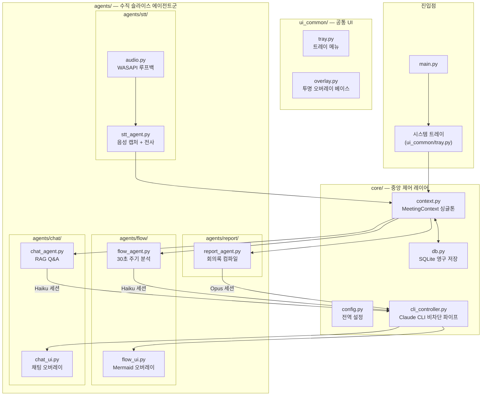

# PrismFlow 최종 구현 계획서

> 본 문서(`docs/implementation_plan.md`)는 PrismFlow 프로젝트 계획의 **유일한 정본(Single Source of Truth)** 입니다.
> 별도의 미러나 복제본을 두지 않으며, 모든 Phase 설계 변경은 이 문서에 직접 점진적으로 반영합니다.
> (`docs/task.md` 역시 진행률 상태판의 유일한 정본이며, `artifacts/`는 세션 handoff 문서 전용입니다.)

---

## 📌 목차 (Table of Contents)

1. [1. 프로젝트 정의](#1-프로젝트-정의)
2. [2. 확정된 설계 결정 사항](#2-확정된-설계-결정-사항)
   * [2-1. 시각화 엔진: Mermaid.js + QWebEngineView (로컬 번들링)](#2-1-시각화-엔진-mermaidjs--qwebengineview-로컬-번들링)
   * [2-2. Claude CLI 세션 분리 및 컨텍스트 병합](#2-2-claude-cli-세션-분리-및-컨텍스트-병합)
   * [2-3. STT 및 화자 분리](#2-3-stt-및-화자-분리)
   * [2-4. 최종 보고서 저장](#2-4-최종-보고서-저장)
3. [3. 시스템 아키텍처](#3-시스템-아키텍처)
4. [4. 프로젝트 트리 구조](#4-프로젝트-트리-구조)
5. [5. Phase별 개발 계획 및 ReAct 검증](#5-phase별-개발-계획-및-react-검증)
   * [Phase 1: Core 인프라 + 시스템 트레이 + 투명 오버레이 GUI](#phase-1-core-인프라--시스템-트레이--투명-오버레이-gui)
   * [Phase 2: SQLite DB + STT 실시간 엔진 & Mock 에뮬레이터 설계](#phase-2-sqlite-db--stt-실시간-엔진--mock-에뮬레이터-설계)
   * [Phase 3: Claude CLI 파이프 + Flow Agent + Mermaid 시각화 & 스마트 화면 융합](#phase-3-claude-cli-파이프--flow-agent--mermaid-시각화--스마트-화면-융합)
   * [Phase 4: Chat Agent + 하이브리드 RAG + 대화창 UI](#phase-4-chat-agent--하이브리드-rag--대화창-ui)
   * [Phase 4-2: 예외 처리, 통합 최적화 및 융합 데모 (AppCoordinator 연동)](#phase-4-2-예외-처리-통합-최적화-및-융합-데모-appcoordinator-연동)
   * [Phase 4-3: 추가 최적화 및 설정/환경 고도화 (Settings, Screen DB, CLI Path Override, Local WebFont)](#phase-4-3-추가-최적화-및-설정환경-고도화-settings-screen-db-cli-path-override-local-webfont)
   * [Phase 5: Report Agent + 최종 보고서 + 통합 최적화](#phase-5-report-agent--최종-보고서--통합-최적화)
   * [Phase 6: 실제 오픈소스 STT/화자분리 모델 연동 및 실시간 검증](#phase-6-실제-오픈소스-stt화자분리-모델-연동-및-실시간-검증)
6. [6. AI 바이브 코딩 문서 체계 및 운영 규칙](#6-ai-바이브-코딩-문서-체계-및-운영-규칙)
7. [7. 검증 계획 요약](#7-검증-계획-요약)
8. [8. 상세 구현 설계서: Phase 7 & Phase 8](#8-상세-구현-설계서-phase-7--phase-8)
   * [Phase 7: E2E 통합 하네스, 디버깅 및 예외 하드닝 (E2E 특집)](#phase-7-e2e-통합-하네스-디버깅-및-예외-하드닝-e2e-특집)
     * [7-1. E2E 통합 테스트 하네스 (tests/e2e_harness.py) 구축](#7-1-e2e-통합-테스트-하네스-testse2e_harnesspy-구축)
     * [7-2. Claude CLI 에러 하드닝 및 로컬 Fallback(대체) 모드 구현](#7-2-claude-cli-에러-하드닝-및-로컬-fallback대체-모드-구현)
     * [7-3. WAV 원본 실시간 녹음 및 전사록 텍스트(.txt) 실시간 저장](#7-3-wav-원본-실시간-녹음-및-전사록-텍스트txt-실시간-저장)
     * [7-4. Flow 에이전트의 증분(Delta) 전사 업데이트 및 히스토리 저장](#7-4-flow-에이전트의-증분delta-전사-업데이트-및-히스토리-저장)
     * [7-5. I2T 에이전트 (Image-to-Text Agent) 신설 및 캡처 연동](#7-5-i2t-에이전트-image-to-text-agent-신설-및-캡처-연동)
     * [7-6. 사용자 오인식 교정(Auto-Correction Map) 및 자가 개선 루프](#7-6-사용자-오인식-교정auto-correction-map-및-자가-개선-루프)
     * [7-7. 실시간 전사 가시성(라이브 자막) 제공](#7-7-실시간-전사-가시성라이브-자막-제공)
   * [Phase 8: 오프라인 원클릭 패키징 및 가중치 모델 통합 배포 (순연)](#phase-8-오프라인-원클릭-패키징-및-가중치-모델-통합-배포-순연)
     * [8-1. pyannote 토큰리스 오프라인 로컬 로드 설계 상세](#8-1-pyannote-토큰리스-오프라인-로컬-로드-설계-상세)
     * [8-2. Portable Python 격리 패키지 구조 설계 상세](#8-2-portable-python-격리-패키지-구조-설계-상세)
     * [8-3. Inno Setup 인스톨러 빌드 상세](#8-3-inno-setup-인스톨러-빌드-상세)

---

## 1. 프로젝트 정의

**PrismFlow**는 Windows 시스템 트레이에 상주하면서, 로컬 디바이스에서 회의 음성을 실시간 감지·녹음·전사(STT)하고, 4개의 독립 AI 에이전트(STT · Flow · Chat · Docs)가 유기적으로 협업하여 회의 흐름 시각화, 맥락 기반 Q&A, 최종 회의록 생성을 수행하는 **차세대 AI 회의 어시스턴트**입니다.

### 핵심 제약 조건
- **On-Device 영역 (외부 네트워크 불필요)**
  - STT 음성 인식 및 화자 분리: `faster-whisper` + `pyannote.audio` 로컬 실행
  - PySide6 UI 프로그램 전체 운영: 시스템 트레이, 투명 오버레이, QWebEngineView
- **Claude CLI 경유 영역 (로컬 CLI가 Anthropic 서버와 통신)**
  - Flow Agent: 회의 흐름 Mermaid 구조도 생성 (Haiku)
  - Chat Agent: 맥락 기반 실시간 Q&A (Haiku)
  - Docs Agent: 최종 회의록 Markdown 생성 (Opus)
  - ※ 외부 REST API를 직접 호출하지 않고, 로컬에 설치된 `claude` CLI를 `subprocess.Popen` 파이프로 제어
- **하드웨어 가속 (STT 전용, 자동 감지)**
  - Windows 11 고정 — OS 호환성 보장
  - 사용자 하드웨어 환경이 다를 수 있으므로 프로그램 기동 시 **자동 감지 순서**를 적용:
    1. NVIDIA GPU 감지 → CUDA(float16/int8) 가속
    2. Intel GPU/NPU 감지 → OpenVINO 가속
    3. 위 둘 다 없을 경우 → **CPU 폴백** (속도는 느리지만 반드시 동작 보장)
  - 설정 화면에서 사용자가 수동으로 가속 방식을 오버라이드할 수 있음
- **UI 프레임워크** — PySide6 (투명 오버레이 + QWebEngineView)

---

## 2. 확정된 설계 결정 사항

### 2-1. 시각화 엔진: Mermaid.js + QWebEngineView (로컬 번들링)

| 항목 | 내용 |
|:---|:---|
| **선택** | Mermaid.js를 `QWebEngineView`에서 렌더링 |
| **이유** | CSS 기반 Glassmorphism 스타일링 자유도, 자동 레이아웃 엔진 |
| **오프라인 보장** | `mermaid.min.js`를 프로젝트 내부 `resources/`에 로컬 파일로 패키징 |

### 2-2. Claude CLI 세션 분리 및 컨텍스트 병합

| 세션 | 모델 | 역할 | 컨텍스트 전략 |
|:---|:---|:---|:---|
| **Flow 세션** | Haiku | 30초 주기 Mermaid 구조도 생성 | 누적 발화 전체를 슬라이딩 윈도우로 추출 |
| **Chat 세션** | Haiku | 사용자 Q&A 즉시 응답 | 최근 10분 발화 원본 + Flow 요약 + 현재 Mermaid 코드 결합 |
| **Docs 세션** | Opus | 회의 종료 시 최종 보고서 | 전체 STT 원본 + 최종 Flow + Chat 이력 통합 |

- **통신 방식**: `subprocess.Popen` 상주 세션 + 백그라운드 스레드 + `queue.Queue` 비차단 I/O
- Flow와 Chat은 **별도 프로세스**로 완전 분리하여 스레드 데드락 방지

### 2-3. STT 및 화자 분리

- 설정 화면에서 Whisper 모델 크기(base/medium/large) 및 가속(CUDA/OpenVINO/CPU) 선택
- 모델 미존재 시 다운로드 상태바 제공
- **개발용 Mock 모드**: 15~20초 주기로 가상 다자 대화 자동 주입 (토글)

### 2-4. 최종 보고서 저장

- 저장 경로: `%USERPROFILE%\Documents\PrismFlow\YYYY-MM-DD\`
- 포맷: Markdown (회의 요약 + 의제별 쟁점 + 결정 사항 + Todo + Mermaid 소스 포함)
- 저장 후 Windows 기본 연결 프로그램으로 자동 실행

---

## 3. 시스템 아키텍처



---

## 4. 프로젝트 트리 구조

```text
E:\Tak\Gemini\PrismFlow\
│
│   ── 프로젝트 관리 ──────────────────────────────────────────
├── agent.md                        # AI 내비게이션: 읽기 순서, 수정 위치 안내, 코딩 규칙
├── main.py                         # 앱 진입점: QApplication 생성, 트레이 기동, 에이전트 오케스트레이션
├── run.bat                         # Windows 원클릭 실행 (가상환경 활성화 + python main.py)
│
│   ── 산출물 문서 ─────────────────────────────────────────────
├── docs/
│   ├── implementation_plan.md      # Phase 진입 전 업데이트하는 상세 구현 설계서
│   ├── task.md                     # Phase 진행 중/완료 후 업데이트하는 진행률 상태판
│   └── history.md                  # Phase 완료 시 작성하는 시행착오 및 의사결정 위키 스토리
│
│   ── ReAct 검증 ──────────────────────────────────────────────
├── tests/
│   ├── __init__.py
│   ├── conftest.py                 # 공통 피스처: 임시 DB, Mock CLI, QApplication 인스턴스
│   ├── test_core.py                # config / context 싱글톤 스레드 세이프티 검증
│   ├── test_db.py                  # SQLite 스키마 생성, CRUD, 세션 복원 테스트
│   ├── test_cli.py                 # Claude CLI 파이프 비차단 I/O, 타임아웃, 데드락 검증
│   ├── test_stt.py                 # Mock 발화 스트림 → MeetingContext 파이프라인 검증
│   ├── test_flow.py                # Mermaid 코드 파싱, 노드 재사용(Upsert) 유효성 검사
│   ├── test_chat.py                # RAG 컨텍스트 조립 (10분 발화 + Flow 요약 + Mermaid) 검증
│   └── test_report.py              # Markdown 최종 리포트 생성 및 파일 I/O 검증
│
│   ── 메인 패키지 ─────────────────────────────────────────────
└── prismflow/
    ├── __init__.py
    │
    ├── core/                       # ■ 중앙 제어 레이어 (모든 에이전트가 의존)
    │   ├── __init__.py
    │   ├── config.py               #   전역 환경설정 (경로, 모델, 가속, 윈도우 기본값)
    │   ├── context.py              #   Thread-safe MeetingContext 싱글톤 + Qt Signal 방출
    │   ├── db.py                   #   SQLite 연결, 스키마 마이그레이션, 세션/발화/채팅 CRUD
    │   └── cli_controller.py       #   Claude CLI Popen 래퍼: 세션 생성, 비차단 읽기, 모델 지정
    │
    ├── ui_common/                  # ■ 공유 UI 컴포넌트
    │   ├── __init__.py
    │   ├── tray.py                 #   시스템 트레이 아이콘 + 우클릭 메뉴 (회의 시작/종료/설정/종료)
    │   └── overlay.py              #   투명 오버레이 베이스: FramelessHint, 호버 페이드, 드래그 이동
    │
    └── agents/                     # ■ 수직 슬라이스 에이전트 (각 폴더가 독립 기능 단위)
        │
        ├── stt/                    # ① STT 에이전트 슬라이스
        │   ├── __init__.py
        │   ├── stt_agent.py        #   QThread: VAD 청크 → faster-whisper 전사 → context 적재
        │   └── audio.py            #   sounddevice / WASAPI 루프백 캡처 유틸
        │
        ├── flow/                   # ② Flow 시각화 에이전트 슬라이스
        │   ├── __init__.py
        │   ├── flow_agent.py       #   QThread: 30초 슬라이딩 윈도우 → Claude Haiku → Mermaid 코드
        │   ├── flow_ui.py          #   QWebEngineView 투명 오버레이 (overlay.py 상속)
        │   ├── mermaid_html.py     #   로컬 js 임베드 HTML 템플릿 생성기
        │   └── resources/
        │       └── mermaid.min.js  #   오프라인용 로컬 번들 Mermaid.js 라이브러리
        │
        ├── chat/                   # ③ Chat 어시스턴트 에이전트 슬라이스
        │   ├── __init__.py
        │   ├── chat_agent.py       #   QThread: RAG 컨텍스트 조립 → Claude Haiku → 스트리밍 응답
        │   └── chat_ui.py          #   입력창 + 대화 히스토리 투명 오버레이 (overlay.py 상속)
        │
        └── report/                 # ④ Report 보고서 에이전트 슬라이스
            ├── __init__.py
            └── report_agent.py     #   Claude Opus → Markdown 컴파일 → 파일 저장 → 자동 실행
```

---

## 5. Phase별 개발 계획 및 ReAct 검증

### Phase 1: Core 인프라 + 시스템 트레이 + 투명 오버레이 GUI

#### 개발 범위
| 대상 파일 | 작업 내용 |
|:---|:---|
| `prismflow/core/config.py` | 전역 설정 클래스 정의 (경로, 모델 크기, 가속 방식, UI 기본값) |
| `prismflow/core/context.py` | `MeetingContext` 싱글톤 뼈대 — 스레드 Lock + Qt Signal 정의 |
| `prismflow/ui_common/overlay.py` | 투명 오버레이 베이스 윈도우 (FramelessHint, 호버 페이드 애니메이션, 드래그 이동) |
| `prismflow/ui_common/tray.py` | 시스템 트레이 아이콘 + 메뉴 (회의 시작/종료/대시보드/설정/종료) |
| `main.py` | QApplication 생성 → 트레이 기동 → 오버레이 인스턴스 테스트 |
| `tests/conftest.py` | QApplication 피스처, 임시 설정 경로 |
| `tests/test_core.py` | config 로드, context 싱글톤 스레드 세이프티 |

#### ReAct 검증
```bash
.venv\Scripts\python -m pytest tests/test_core.py -v
```

---

### Phase 2: SQLite DB + STT 실시간 엔진 & Mock 에뮬레이터 설계

#### 개발 범위
| 대상 파일 | 작업 내용 |
|:---|:---|
| `prismflow/core/db.py` | SQLite 연결, 스키마 생성 및 CRUD 구현 (시작/종료 시간 개별 필드 적용) |
| `prismflow/core/context.py` | DB 연동 확장 — 회의 시작/종료/발화 추가 시 DB에 실시간 저장 수행 |
| `prismflow/agents/stt/audio.py` | PyAudio 기반 마이크 오디오 실시간 캡처 유틸 (16000Hz, Mono, Float32, 링버퍼 적재 Lock 제어) |
| `prismflow/agents/stt/stt_agent.py` | `RealTimeEngineWorker` (QThread) 구현:<br/>1. OpenVINO GenAI 2025.0 Stateful Whisper 및 pyannote-openvino 실시간 추론 연동<br/>2. 가중치 미존재 시 안내 다이얼로그 처리<br/>3. Mock 모드: 가상 한국어 대화 큐를 통해 실제 엔진과 동일한 (start, end, speaker, text) 신호 주기적 방출 |
| `tests/test_db.py` | 스키마 자동 생성, 발화 및 세션 CRUD 검증 테스트 |
| `tests/test_stt.py` | STT 스레드 기동 후 실제 오디오 수집 버퍼 작동 및 Mock 모드 신호 발생 주기 검증 |

#### SQLite 테이블 상세 설계 (정밀화)
1. **회의 세션 (`meeting_sessions`)**:
   - `session_id` (TEXT, PK): timestamp 기반 ID (`YYYYMMDD_HHMMSS`)
   - `title` (TEXT): 회의 제목 (기본값: "새로운 회의")
   - `start_time` (TEXT): 회의 시작 일시 (ISO8601)
   - `end_time` (TEXT, NULLABLE): 회의 종료 일시 (ISO8601)
   - `summary` (TEXT, NULLABLE): 최종 요약 보고서 본문
2. **발화 데이터 (`transcripts`)**:
   - `id` (INTEGER, PK AUTOINCREMENT): 발화 순번
   - `session_id` (TEXT, FK): `meeting_sessions.session_id` 외래키
   - `speaker` (TEXT): 화자 식별자 (예: Speaker_00, Speaker_01 등)
   - `text` (TEXT): 전사된 대화 텍스트
   - `start_time` (REAL): 발화 시작 타임스탬프 (초)
   - `end_time` (REAL): 발화 종료 타임스탬프 (초)
3. **채팅 기록 데이터 (`chat_logs`)**:
   - `id` (INTEGER, PK AUTOINCREMENT): 채팅 로그 ID
   - `session_id` (TEXT, FK): `meeting_sessions.session_id` 외래키
   - `query` (TEXT): 사용자 질문 내용
   - `response` (TEXT): Claude CLI를 통해 전달받은 Q&A 답변 내용
   - `timestamp` (REAL): Q&A 시점 UNIX Epoch Timestamp
4. **애플리케이션 설정 (`settings`)**:
   - `key` (TEXT, PK): 설정 식별자 (예: `whisper_model_size`, `hardware_acceleration`, `vad_threshold` 등)
   - `value` (TEXT): 설정값

#### STT & Diarization 핵심 파이프라인 설계 규칙
* **오디오 표준 규격**: 샘플 레이트 `16000Hz`, 단일 채널(`Mono`), 데이터 타입 `Float32`
* **추론 윈도우 알고리즘**: 5.0초 분석 윈도우, 0.5초 시프트 슬라이딩 윈도우 적용
* **추론 파라미터 강제 제어**:
  - `condition_on_previous_text = False` (환각 누적 방지)
  - `language = "<|ko|>"` (언어 감지 생략, 약 50ms 지연 단축)
  - `word_timestamps = True` (정밀 타임라인 동기화)
  - Diarization: `duration = 5.0, step = 0.5, rho_update = 0.1`

#### ReAct 검증
```bash
.venv\Scripts\python -m pytest tests/test_db.py tests/test_stt.py -v
```

---

### Phase 3: Claude CLI 파이프 + Flow Agent + Mermaid 시각화 & 스마트 화면 융합

#### 개발 범위
| 대상 파일 | 작업 내용 |
|:---|:---|
| `prismflow/core/cli_controller.py` | Claude CLI 래퍼: `-p` (프린트) 모드 기반 단발성 비동기 호출 구현, `< NUL` 리다이렉션을 통한 TTY 경고 방어 및 데드락 0% 보장, UUID 기반 세션 관리 |
| `prismflow/agents/flow/flow_agent.py` | 30초 슬라이딩 윈도우 → Claude Haiku 프롬프트 → Mermaid 코드 파싱<br/>- **Stateful Update**: 직전 Mermaid 코드를 함께 전송하여 기존 노드 구조 재사용(Upsert) 유도<br/>- **계층화/필터**: 대주제 서브그래프화, 잡담 노이즈 필터 및 흐름선 매핑 |
| `prismflow/agents/flow/flow_ui.py` | QWebEngineView 투명 오버레이 + 동적 Mermaid 렌더링 |
| `prismflow/agents/flow/mermaid_html.py` | 로컬 js 임베드 HTML 템플릿 생성기 |
| `prismflow/agents/flow/resources/mermaid.min.js` | 오프라인용 라이브러리 다운로드 배치 |
| `prismflow/core/screen_detector.py` [NEW] | **스마트 화면 맥락 감지**: PPT 슬라이드 감지(Office COM API - win32com) 및 범용 감지(Pillow 32x32 초경량 픽셀 변화율 MSE 분석)<br/>- 30초 정착(Settled) 디바운스 및 가벼운 시각 지시어 매핑 적용 |
| `tests/test_cli.py` | 로컬 Claude CLI `-p` 호출 타임아웃, 세션 공유, 에러 발생 예외 처리 검증 |
| `tests/test_flow.py` | Mermaid 코드 문법 유효성, 노드 재사용(Upsert) 검사, 화면 전환 이벤트 연계 검증 |

#### 상세 기술 설계 명세

##### 1. Claude CLI 비차단 통신 (`cli_controller.py`)
- **비대화형(Print) 모드 강제 및 리다이렉션**:
  - `claude` CLI를 대화형 Popen 상주 프로세스로 유지하면 Windows의 입출력 버퍼 데드락, ANSI 이스케이프 코드 가공 등 극심한 불안정성에 노출됩니다.
  - 이를 원천 방어하기 위해 `claude -p "<프롬프트>" --session-id <UUID> --model <모델>` 형태로 호출하는 단발성 실행 모델을 채택합니다.
  - Windows TTY 미감지 대기 경고(`Warning: no stdin data received in 3s`)를 해결하기 위해 standard input을 `subprocess.DEVNULL` (또는 Windows CMD `< NUL`)로 리다이렉션합니다.
- **세션 격리 및 병렬 처리**:
  - 각 에이전트(Flow, Chat, Docs)는 초기화 시 고유한 `uuid.uuid4()` 세션 ID를 생성하여 요청 시 전달합니다.
  - Claude CLI 호출은 Python의 `subprocess.run(..., capture_output=True, text=True, timeout=30)`을 사용하여 동기 실행하되, 에이전트의 자체 `QThread` 안에서 독립적으로 작동하므로 메인 UI 스레드를 절대 블로킹하지 않습니다.
- **비차단 큐 피드백**:
  - UI 렌더러와 CLI 에이전트 간의 통신은 Qt Signal을 이용해 안전하게 비동기 스레드 바운더리를 넘어 데이터가 전송되도록 구현합니다.

##### 2. 오프라인 Mermaid 시각화 UI (`flow_ui.py`, `mermaid_html.py`)
- **오프라인 라이브러리 번들링**: 
  - `prismflow/agents/flow/resources/mermaid.min.js`에 번들링된 라이브러리를 로드하여 순수 오프라인 상태에서도 동작을 보장합니다.
- **HTML 템플릿 및 스타일링**:
  - `mermaid_html.py`는 로컬 `mermaid.min.js`를 상대경로로 참조하는 HTML 템플릿을 생성합니다.
  - Glassmorphism 느낌의 반투명 다크 디자인을 적용하기 위해 HSL 테마 컬러 및 `backdrop-filter: blur(10px)` 등을 CSS에 빌드합니다.
- **깜빡임 없는 동적 렌더링**:
  - 30초마다 새로운 Mermaid 다이어그램 신호가 도달할 때, `QWebEngineView.reload()`를 호출하면 화면이 깜빡이거나 하얗게 로딩이 드러나 시인성이 매우 낮아집니다.
  - 이를 방지하기 위해 HTML 로드 후, 신호가 들어올 때마다 `QWebEngineView.page().runJavaScript(f"updateDiagram(\"{encoded_mermaid_code}\")")`를 실행하여 JS DOM 상에서 점진적 다이어그램 리렌더링을 처리합니다.

##### 3. Flow Agent 분석 루프 및 스마트 화면 맥락 융합 (`flow_agent.py`, `screen_detector.py`)
- **Stateful 점진적 다이어그램 업데이트**:
  - 매 30초마다 `MeetingContext`에서 최신 발화 내역을 가져와 Claude Haiku에 전달합니다.
  - 프롬프트에 `[기존 Mermaid 코드]`를 함께 전송하며, *"기존 노드들의 ID를 최대한 재사용(Upsert)하고 새로운 소주제 논의 사항은 꼬리에 덧붙여 나가라"*는 프롬프트 제약을 가해 시각적 흐름의 연속성을 보존합니다.
- **스마트 화면 감지기 (ScreenTransitionDetector)**:
  - **30초 정착(Settled) 디바운스**:
    - 화면 변화가 발생하면 즉시 이벤트를 발생시키지 않고, `QTimer`를 기동하여 30초 타이머를 굴립니다.
    - 30초 이내에 추가 화면 변화가 감지되면 타이머를 리셋(Reset) 및 재시작하여, 사용자가 슬라이드를 빠르게 훑는 동안의 중간 전환 과정은 과도한 API 호출로 이어지지 않게 제어합니다.
  - **파워포인트 전체화면 감지 (win32com.client)**:
    - Windows COM API를 활용하여 실행 중인 PowerPoint.Application의 `SlideShowWindows` 및 `ActivePresentation` 객체를 추적합니다.
    - 슬라이드가 변경되어 `SlideShowWindow.View.CurrentShowPosition` (SlideIndex) 값이 바뀌는 순간을 정밀 추적합니다.
  - **범용 화면 감지 폴백 (Pillow + MSE)**:
    - PPT 실행 중이 아닐 경우 `PIL.ImageGrab.grab()`을 통해 1초 주기 스냅샷을 캡처합니다.
    - 오버헤드를 극단적으로 줄이기 위해 캡처본을 32x32 크기로 축소하고, GrayScale로 변환하여 numpy 배열로 바꿉니다.
    - 직전 32x32 이미지와 현재 이미지의 MSE (Mean Squared Error)를 계산하여 임계값(예: 10.0)을 넘을 때 화면 변화가 일어난 것으로 간주합니다.
  - **중복 전송 방지 (Deduplication)**:
    - PPT 화면: `Presentation.Name` + `SlideIndex`가 직전 확정 상태와 동일하면 무시합니다.
    - 범용 화면: 정착 완료된 32x32 캡처본의 픽셀 간 차이가 직전 확정본과 거의 동일한 경우(MSE < 1.0) 중복으로 판단해 캡처 이벤트를 생략(Skip)합니다.
  - **시각 지시어 결합**:
    - STT 발화 중 "여기 보시면", "이 슬라이드", "이 도표" 등 화면 지칭용 지시어가 가볍게 매칭되는 순간, 대기 중이던 확정 캡처 데이터를 결합하여 Claude CLI 측에 맥락 보조 자료로 제공합니다.
- **회의 논리 계층화**:
  - 논의의 큰 줄기는 Mermaid `subgraph`로 묶어서 구조화하고, 잡담이나 인사는 Haiku 프롬프트 수준에서 무시하도록 프롬프트를 고도화합니다.

#### ReAct 검증
```bash
.venv\Scripts\python -m pytest tests/test_cli.py tests/test_flow.py -v
```

---

### Phase 4: Chat Agent + 하이브리드 RAG + 대화창 UI

#### 개발 범위
| 대상 파일 | 작업 내용 |
|:---|:---|
| `prismflow/agents/chat/chat_agent.py` | 백그라운드 컨텍스트 주입기(Context Ingester) 및 Q&A 비동기 스레드 개발<br/>- 3분 간격 신규 발화 백그라운드 자동 주입(CLI 세션 적재)<br/>- 질문 시점의 미주입 실시간 잔여 발화 + 사용자 질문 병합 전송<br/>- 마이크 제어를 원천 배제한 텍스트 단독 입력 지원 |
| `prismflow/agents/chat/chat_ui.py` | QTextBrowser 기반 Markdown 대화 히스토리 및 QLineEdit 입력창을 탑재한 투명 오버레이 UI 개발 (QSS Glassmorphism 및 그라데이션 포커스 효과 적용) |
| `tests/test_chat.py` | 주기적 전사록 백그라운드 주입 로직, 미주입 발화 병합 쿼리 구성, 모의 스트리밍 렌더링 검사 |

#### 상세 기술 설계 명세

##### 1. 백그라운드 컨텍스트 주입(Context Ingestion) 및 Q&A 스레드 (`chat_agent.py`)
- **오디오 경합 방지**:
  - 로컬 STT 에이전트와의 사운드 장치 독점 경합을 피하기 위해 Chat 에이전트의 마이크 음성 입력 기능은 완전히 배제하고, 키보드 텍스트 입력창만 단독 제공합니다.
- **3분 주기 전사록 백그라운드 주입**:
  - 질문 시점에 무거운 전체 회의 전사록을 매번 전송하면 토큰 낭비 및 응답 지연이 심해집니다.
  - 이를 해결하기 위해 백그라운드 주입 루프(`BackgroundIngester`)를 구동하여, **3분 주기**로 새로 추가된 신규 발화문만 떼어내어 로컬 Claude CLI 세션에 빌드업해 둡니다:
    `claude -p "[시스템: 다음은 회의 중 추가된 신규 대화 내용입니다. 기억해 두세요.]\n{new_transcripts}" --resume chat-session-{session_id}`
  - 주입을 마치면 마지막 주입 완료 발화 인덱스(`last_ingested_idx`)를 업데이트합니다.
- **질문 시점 실시간 동기화 및 고속 쿼리**:
  - 사용자가 질문을 던지는 시점에는 이미 Claude 세션 메모리가 회의 전체 흐름을 알고 있으므로, 전체 텍스트를 보낼 필요가 없습니다.
  - 단, 3분 주기 주입 시점과 질문 시점 사이의 짧은 미주입 발화(0~3분 분량)가 있을 수 있으므로, 질문 시에는 미주입 잔여 발화만 질문 위에 가볍게 얹어서 호출합니다:
    `claude -p "[최근 대화 추가]\n{unsubmitted_transcripts}\n\n[질문]\n{user_query}" --resume chat-session-{session_id}`
  - 이를 통해 **API 토큰 소모량을 90% 이상 차감하고, 사용자 질문 시 즉각적인 답변 속도를 확보**합니다. 회의가 완전히 종료된 후에는 별도의 전사록 주입 없이 순수하게 질문/출력 세션만 복원하여 가볍게 연속 Q&A가 가능합니다.
- **비동기 스트리밍 출력**:
  - `subprocess.Popen`으로 `stdout`을 `PIPE`로 감시하여, Claude CLI의 스트리밍 토큰 출력을 줄 단위로 획득하고 Qt Signal(`token_delivered`)을 통해 UI 스레드로 비동기 안전 전송합니다.

##### 2. QSS 기반 Glassmorphism 대화 오버레이 UI (`chat_ui.py`)
- **디자인 테마 및 레이아웃**:
  - `TranslucentOverlay`를 상속하여 우측 하단에 상주하는 420x580 크기의 메신저 형태 대화창을 구현합니다.
  - 배경에 어두운 반투명 색상(`RGBA(25, 25, 30, 200)`) 및 14px 라운딩 처리, 테두리에 실버 그라데이션 보더를 QSS로 세밀하게 입힙니다.
- **입출력 컴포넌트 고도화**:
  - **대화 히스토리 뷰**: `QTextBrowser`를 활용해 마크다운 및 HTML 파싱을 활성화합니다. 이를 통해 코드 블록(syntax highlight), 볼드, 리스트가 아름다운 개발자 지향적 레이아웃으로 렌더링되게 만듭니다.
  - **텍스트 입력창**: `QLineEdit`를 사용하여 테두리를 반투명하게 둥글리고, 마우스 포커스가 들어갈 때 딥퍼플(`rgb(124, 77, 255)`) 그라데이션으로 빛나는 트랜지션 애니메이션 효과를 부여합니다.
  - **로딩 및 입력 잠금**: 답변이 생성 중인 동안에는 입력창을 `setEnabled(False)`로 잠그고, 대화창 하단에 부드럽게 점멸하는 'Claude가 생각하는 중...' 로딩 레이블을 노출합니다.

#### ReAct 검증
```bash
.venv\Scripts\python -m pytest tests/test_chat.py -v
```

---

### Phase 4-2: 예외 처리, 통합 최적화 및 융합 데모 (AppCoordinator 연동)

#### 개발 범위
| 대상 파일 | 작업 내용 |
|:---|:---|
| `main.py` | `ChatAgent` 및 `ChatUI` 인스턴스화 및 우측 하단 자동 배치 연동<br/>- 메인 윈도우 좌표 배치: 화면 우측 하단 여백 (`x = screen.width() - chat_ui.width() - 40`, `y = screen.height() - chat_ui.height() - 100`) |
| `prismflow/agents/chat/chat_agent.py` | 백그라운드 비동기 스레드 클린업 로직 구현 (`cleanup` 메소드 추가 및 실행 중인 Ingest/QNA Worker 종료 처리)<br/>- 초기 세션 로드 완료 시그널 방출 및 대기 처리 |
| `prismflow/agents/chat/chat_ui.py` | 초기 세션 생성 대기 중 입력창 임시 비활성화 처리 및 완성도 보강 |
| `prismflow/core/screen_detector.py` | win32com 파워포인트 체크 시 예외 방어막 추가 (PPT 실행 중이 아니거나 로딩 에러 시 `GENERIC` 캡처 폴백 보장) |
| `tests/test_chat.py` | `ChatAgent.cleanup` 스레드 정리 및 예외 안전성 테스트 케이스 보강 |

#### 상세 기술 설계 명세
1. **AppCoordinator 연동 (`main.py`)**:
   - `AppCoordinator.__init__`에서 `self.chat_agent = ChatAgent(self.context, self.cli_controller)` 및 `self.chat_ui = ChatUI(self.chat_agent)`를 생성합니다.
   - 트레이 아이콘과 동일하게 앱 시작 시 메인 윈도우 우측 하단에 상주하도록 고정합니다.
   - 회의가 종료(`_on_meeting_ended`)될 때 `stt_worker`나 `flow_agent`는 멈추지만, Q&A 대화는 회의 종료 후에도 계속 가능하게 `chat_ui`는 그대로 유지합니다.
2. **백그라운드 스레드 누수 방지 (`chat_agent.py`)**:
   - `ChatAgent`에 `cleanup(self)` 메소드를 탑재하여 `ingest_timer.stop()`, 기동 중인 모든 QThread(`IngestWorker`, `ChatQNAWorker`) 인스턴스를 순회하며 `wait()` 및 종료 대기를 수행합니다.
   - `main.py`의 `AppCoordinator`가 소멸하거나 앱 종료 시 이를 명시적으로 호출합니다.
3. **스마트 화면 감지 PPT 예외 격리 (`screen_detector.py`)**:
   - win32com을 사용한 `_get_active_ppt_info` 내부에서 `pywintypes.com_error` 등 모든 COM 예외를 완전 캡처하여 `None`을 리턴하게 함으로써, 백그라운드 탐지 루프가 PPT 오류에 의해 무한 루프 폭사하지 않도록 합니다.

#### ReAct 검증
```bash
.venv\Scripts\python -m pytest tests/test_chat.py -v
.venv\Scripts\python -m pytest tests/test_flow.py -v
```

---

### Phase 4-3: 추가 최적화 및 설정/환경 고도화 (Settings, Screen DB, CLI Path Override, Local WebFont)

#### 개발 범위
| 대상 파일 | 작업 내용 |
|:---|:---|
| `prismflow/core/db.py` | `screen_logs` 테이블 생성 마이그레이션 및 화면 로그 추가/조회 기능 구현 (`add_screen_log`, `get_screen_logs`) |
| `prismflow/core/context.py` | `update_screen_info` 실행 시 SQLite `screen_logs` 테이블에 화면 맥락 로그 실시간 영구 적재 연동 |
| `prismflow/core/config.py` | `claude_cli_cmd` 초기 로드 시 DB의 `settings` 테이블 오버라이드 로직 적용 |
| `prismflow/ui_common/settings_ui.py` [NEW] | 콤보박스, 슬라이더, 파일 브라우저 및 SQLite `settings` 저장 버튼을 탑재한 설정 다이얼로그(`SettingsDialog`) GUI 개발 |
| `prismflow/ui_common/tray.py` | "설정" 메뉴 클릭 시 `SettingsDialog`를 기동하고 `AppConfig` 업데이트와 실시간 연동 |
| `prismflow/resources/Pretendard-Regular.ttf` [NEW] | 가독성이 뛰어난 Pretendard 폰트 파일을 프로젝트 로컬에 수동 패키징 및 번들 배치 |
| `main.py` | 앱 시작 시 `QFontDatabase`를 이용해 Pretendard 로컬 폰트를 등록하고 QSS 스타일시트(`font-family: 'Pretendard'`)에 바인딩 적용 |
| `tests/test_db.py` | `screen_logs` 테이블 스키마 생성 및 CRUD 검증 테스트 케이스 추가 |
| `tests/test_core.py` | DB에 저장된 `claude_cli_cmd`가 `AppConfig`에 로드 및 오버라이드되는지 검증하는 테스트 추가 |

#### 상세 기술 설계 명세
1. **`screen_logs` 데이터베이스 스키마 설계**:
   - `id` (INTEGER PRIMARY KEY AUTOINCREMENT)
   - `session_id` (TEXT, FK): `meeting_sessions.session_id` 외래키 (ON DELETE CASCADE)
   - `screen_type` (TEXT): "PPT" 또는 "GENERIC"
   - `screen_info` (TEXT): PPT인 경우 `"파일명|페이지번호"`, GENERIC인 경우 32x32 픽셀 강도 데이터를 문자열(또는 base64)로 변환해 저장
   - `timestamp` (REAL): 로그가 적재된 에폭 시간
2. **Claude CLI 경로 동적 오버라이드**:
   - `AppConfig` 인스턴스화 또는 로드 시, `DatabaseManager`를 가볍게 열어 `get_setting("claude_cli_cmd")` 값이 존재할 경우 해당 객체의 `claude_cli_cmd` 멤버를 덮어씁니다.
   - 설정 화면에서 경로 저장 시 `DatabaseManager.set_setting("claude_cli_cmd", path)`를 실행해 DB에 영구 기록합니다.
3. **로컬 웹폰트 Pretendard 번들링**:
   - 폰트 파일 `prismflow/resources/Pretendard-Regular.ttf`를 internal 리소스로 다운로드/배치합니다.
   - `main.py` 진입점에서 `QFontDatabase.addApplicationFont(font_path)`를 사용해 메모리에 해당 폰트를 활성화하고, QApplication 단위의 QSS 또는 개별 UI QSS에 `font-family: 'Pretendard';`를 전역 선언합니다.

#### ReAct 검증
```bash
.venv\Scripts\python -m pytest tests/test_db.py -v
.venv\Scripts\python -m pytest tests/test_core.py -v
```

---

### Phase 5: Report Agent (구 Docs/Synthesizer Agent) + 최종 보고서 + 통합 최적화

> **명칭 확정**: 추상적이던 `SynthesizerAgent` 대신, 산출물(보고서/리포트)을 직관적으로 드러내는 **`ReportAgent`** / **`ReportWorker`** 로 클래스·폴더·파일명·테스트·문서를 일괄 통일합니다. (폴더 `agents/report/`, 파일 `report_agent.py`, 테스트 `test_report.py`)
> **모델 확정**: 최종 회의록은 추론 품질이 가장 높은 **Opus 4.8 (`claude-opus-4-8`)** 모델로 단발 생성합니다.

#### 개발 범위
| 대상 파일 | 작업 내용 |
|:---|:---|
| `prismflow/agents/report/__init__.py` [NEW] | ReportAgent 모듈 진입점 제공 |
| `prismflow/agents/report/report_agent.py` [NEW] | `ReportAgent` (QObject) 및 `ReportWorker` (QThread) 구현:<br/>- `signals.meeting_ended` 구독 및 세션 종료 자동 감지<br/>- SQLite DB에서 회의 정보, 전체 발화록(`transcripts`), 채팅 히스토리(`chat_logs`) 추출<br/>- `MeetingContext`에서 최종 Mermaid 흐름도 추출<br/>- Claude Opus 4.8 (`claude-opus-4-8`)용 단발 프롬프트 구성 및 비동기 CLI 호출<br/>- Markdown 포맷 회의록 컴파일 (회의 요약 + 아젠다 쟁점 + 최종 Mermaid 소스 + Todo 리스트)<br/>- `%USERPROFILE%\Documents\PrismFlow\Reports\YYYY-MM-DD\` 경로 하위에 `report_{session_id}.md` 파일 실시간 저장<br/>- SQLite `meeting_sessions.summary` 컬럼에 보고서 본문 영구 저장 업데이트<br/>- `os.startfile`을 이용한 Windows 기본 연결 프로그램 자동 실행 및 타 플랫폼 예외 방어 |
| `main.py` | `AppCoordinator`에 `ReportAgent` 인스턴스 연동 및 `signals.meeting_ended` 발생 시 보고서 컴파일 흐름 연결 |
| `run.bat` [NEW] | Windows 원클릭 통합 실행 스크립트 작성 (가상환경 활성화 및 `python main.py` 실행) |
| `tests/test_report.py` [NEW] | ReportAgent 최종 보고서 생성 검증:<br/>- SQLite DB 적재 데이터 및 최종 Mermaid 코드가 올바르게 병합된 프롬프트 구성 확인<br/>- `ClaudeCLIController` Mocking을 통한 Claude Opus 응답 생성 검증<br/>- 임시 디렉토리 하위의 `YYYY-MM-DD` 날짜별 폴더 구조 생성 및 Markdown 파일 인코딩(UTF-8) 저장 검증<br/>- DB의 `meeting_sessions` 테이블 내 `summary` 필드 업데이트 여부 확인<br/>- `os.startfile` 모크 호출 횟수 및 인자 검증 |

#### 상세 기술 설계 명세

##### 1. Report Agent 데이터 융합 및 비동기 생성 스레드 (`report_agent.py`)
- **회의 종료 감지 및 스레드 가동**:
  - `ReportAgent`는 `MeetingContext` 인스턴스의 `signals.meeting_ended` 시그널에 `_on_meeting_ended` 메소드를 바인딩합니다.
  - 해당 시그널이 도달하면 전달받은 `session_id`를 기반으로 `ReportWorker` (QThread) 인스턴스를 동적으로 생성 및 시작하여 백그라운드에서 보고서를 생성하도록 합니다. 이를 통해 회의 종료 시 발생할 수 있는 UI 스레드 멈춤 현상을 원천 방지합니다.
  - 슬롯 진입 시점(메인 스레드)에 `context.current_mermaid_code`를 캡처하여 워커에 전달함으로써, 이후 `context.reset()` 호출과의 레이스 컨디션을 방지합니다.
- **SQLite DB 데이터 수집**:
  - `ReportWorker` 내에서 `db_manager.get_session(session_id)`를 호출해 회의 메타데이터(회의 제목 `title`, 시작 시간 `start_time`, 종료 시간 `end_time`)를 로드합니다.
  - `db_manager.get_transcripts(session_id)`를 통해 회의 시작부터 종료까지 누적된 모든 화자별 발화 목록을 가져옵니다.
  - `db_manager.get_chat_logs(session_id)`를 통해 회의 중 사용자와 어시스턴트 사이에 주고받은 Q&A 채팅 로그 목록을 로드합니다.
  - `context.current_mermaid_code`를 읽어 최종 시각화 Mermaid 흐름도를 가져옵니다.
- **Claude Opus 정밀 보고서 프롬프트 설계**:
  - 수집된 모든 자료를 유기적으로 조합하여 하나의 컨텍스트로 구성하고, Claude Opus 4.8 (`claude-opus-4-8`) 모델에 전달할 프롬프트를 빌드합니다.
  - **프롬프트 템플릿 구조**:
    ```text
    [시스템 역할]
    당신은 PrismFlow 프로젝트의 전문 회의 기록관 및 비즈니스 분석가입니다. 제공된 회의 컨텍스트(STT 발화문, 채팅 히스토리, Mermaid 흐름도)를 정밀 분석하여 임원진 보고용 고품질 Markdown 회의록을 작성하십시오.

    [회의 기본 정보]
    - 세션 ID: {session_id}
    - 회의 제목: {title}
    - 일시: {start_time} ~ {end_time}

    [최종 Mermaid 흐름도]
    {mermaid_code}

    [회의 중 질의응답 (Chat Logs)]
    {chat_logs}

    [전체 STT 전사록]
    {transcripts}

    [작성 규칙 및 구조 가이드라인]
    1. 회의 요약: 회의의 목적, 주요 의제, 핵심 결론 및 합의 내용을 3-4문장으로 명확히 정리하십시오.
    2. 아젠다별 쟁점: 각 세부 아젠다별로 의견이 엇갈렸던 쟁점 사항, 대립된 의견의 흐름, 그리고 최종적으로 합의된 솔루션을 구체적으로 작성하십시오.
    3. 최종 Mermaid 소스: 회의 중 도출된 최종 Mermaid 코드를 코드 블록(```mermaid) 안에 그대로 온전히 포함시키십시오.
    4. Todo 리스트: 회의에서 결정된 향후 작업 항목(Action Item), 담당자, 그리고 언급된 마감 기한을 명확한 리스트 포맷으로 추출하십시오.
    5. 서론, 결론, 혹은 "알겠습니다. 작성해 드리겠습니다"와 같은 AI의 불필요한 메타 설명 문구는 제외하고, 오직 순수한 Markdown 내용만 반환하십시오.
    ```
- **Claude CLI 단발 실행**:
  - `cli_controller.execute_command(prompt, session_id="report-session-{session_id}", model="claude-opus-4-8", timeout=120)`를 수행합니다.
  - Opus 모델 특성상 긴 회의록의 경우 추론 시간이 오래 소요될 수 있으므로 타임아웃 값을 120초로 넉넉하게 지정합니다.
- **날짜별 폴더 구조 저장 및 DB 동기화**:
  - 오늘 날짜에 해당하는 `YYYY-MM-DD` 형식의 폴더를 `%USERPROFILE%\Documents\PrismFlow\Reports\` 하위에 생성합니다. (예: `C:\Users\sando\Documents\PrismFlow\Reports\2026-06-20\`)
  - 생성된 폴더 내에 `report_{session_id}.md` 형태로 파일명을 구성하고, UTF-8 인코딩으로 마크다운 파일을 기록합니다.
  - 파일 저장이 정상적으로 끝나면, SQLite 데이터베이스의 `meeting_sessions` 테이블에서 해당 `session_id` 레코드의 `summary` 컬럼에 생성된 Markdown 보고서 텍스트 전체를 업데이트합니다. (`db_manager.end_session(session_id, end_time=original_end_time, summary=report_content)` 호출)
- **Windows 연결 프로그램 연동**:
  - 파일 생성이 완료되면 `os.startfile(report_filepath)`를 실행하여, 사용자의 Windows 시스템에 기본값으로 지정된 마크다운 뷰어 또는 텍스트 편집기로 문서를 즉시 띄웁니다.
  - 단위 테스트 환경이나 Windows 이외의 플랫폼(예: macOS, Linux)에서는 `os.startfile`이 존재하지 않아 예외가 발생하므로, `sys.platform == 'win32'` 및 `hasattr(os, 'startfile')` 가드가 포함되도록 예외 방어 처리를 합니다.

##### 2. Windows 원클릭 실행 런처 (`run.bat`)
- 가상환경의 활성화 여부를 자동으로 판단하고 애플리케이션 진입점 `main.py`를 원클릭 실행할 수 있는 배치 스크립트를 작성합니다.
```batch
@echo off
title PrismFlow - AI Meeting Assistant
cd /d "%~dp0"

echo [PrismFlow] Activating virtual environment...
if exist ".venv\Scripts\activate.bat" (
    call .venv\Scripts\activate.bat
) else (
    echo [ERROR] Virtual environment (.venv) not found. Please run setup first.
    pause
    exit /b 1
)

echo [PrismFlow] Launching application...
python main.py
if %errorlevel% neq 0 (
    echo [ERROR] Application exited with error code %errorlevel%.
    pause
)
endlocal
```

#### ReAct 검증
```bash
.venv\Scripts\python -m pytest tests/test_report.py -v
.venv\Scripts\python -m pytest tests/ -v
```

---

### Phase 6: 실제 오픈소스 STT/화자분리 모델 연동 및 실시간 검증

> Mock 모드로 완성된 4-에이전트 파이프라인 위에, `stt_agent.py`의 스텁(`_load_openvino_models` / `_process_inference`)을 실제 OpenVINO Whisper + pyannote 화자분리 엔진으로 교체하여 **진짜 마이크 입력으로 동작하는 MVP**를 완성하는 단계.
> **착수 순서 고정: 6-0(Pre-flight 게이트) → 6-1(실엔진) → 6-2(안정화).** 6-0을 통과하지 못하면 6-1 착수 금지.

#### Phase 6-0: MVP 실동작 게이트 (Pre-flight) — STT 코드 수정 전 선행

실제 STT 모델을 얹기 전에, **현재 Mock 기반 MVP가 실제로 구동되는지부터 증명**한다. (Phase 5 감사에서 도출된 필수 선결 항목 #2·#5)

| 항목 | 작업 내용 |
|:---|:---|
| **6-0-A. 에이전트 모델명 실검증** | 로컬 `claude` CLI로 3개 에이전트 모델명을 실제 단발 호출하여 통과 여부 확인:<br/>- Chat/Flow: `claude-3-5-haiku` (구형 별칭 — 거부 가능성 있음)<br/>- Report: `claude-opus-4-8`<br/>- 거부 시 유효 별칭으로 교체(예: Haiku → `claude-haiku-4-5`)하고 `chat_agent.py`·`flow_agent.py`·`report_agent.py` 및 관련 테스트를 동기화<br/>- 검증: 실제 CLI 1회 응답 확인 (옵트인 마커 `@pytest.mark.live` 또는 수동 스모크)<br/><br/>**✅ 결과(2026-06-20, CLI v2.1.183):** `claude-3-5-haiku`는 **2026-02-19 retired**되어 거부(`exit=1`, "It may not exist or you may not have access to it"). `claude-opus-4-8`는 통과(PONG). 대체 별칭 `claude-haiku-4-5`도 통과(PONG) 확인. → **Flow/Chat을 `claude-haiku-4-5`로 교체**(Report는 `claude-opus-4-8` 유지). 동기화 파일: `flow_agent.py`, `chat_agent.py`(2곳), `cli_controller.py`(독스트링 예시), `tests/test_flow.py`(모델 인자 실검증으로 강화). `pytest tests/` → 36 passed. |
| **6-0-B. run.bat E2E 1회 구동** | `run.bat` 실행 → 트레이 → **회의 시작 → Mock 발화 누적 → Flow 다이어그램 표출 → Chat Q&A → 회의 종료 → 보고서 자동 생성·팝업**까지 육안 확인.<br/>- Phase 5에서 수정한 회의 종료 크래시(`QWebEnginePage.html()` → `FlowUI.reset_diagram()`)가 실제로 막혔는지 포함 검증<br/>- 산출물: E2E 체크리스트 + 스크린샷, 발견 이슈 즉시 패치 |

#### Phase 6-1: 실제 STT/화자분리 엔진 구현 (핵심)

| 대상 파일 | 작업 내용 |
|:---|:---|
| `prismflow/agents/stt/stt_agent.py` | `_load_openvino_models()` 실구현:<br/>- 하드웨어 자동 감지 체인 **NVIDIA CUDA → Intel OpenVINO/NPU → CPU 폴백** (설정 수동 오버라이드 허용)<br/>- `openvino-genai` Stateful Whisper 로드 + pyannote 화자분리 파이프라인 탑재<br/>- 가중치 **로컬 경로(`prismflow/resources/models/`) 우선 탐색**으로 오프라인 강제, 미존재 시 안내 다이얼로그/다운로드 상태바<br/><br/>`_process_inference()` 실구현 (현재 `return "Speaker_00", ""` 스텁 대체):<br/>- 추론 규격(§2-3 준수): 5.0초 윈도우 / 0.5초 시프트, `condition_on_previous_text=False`, `language="<|ko|>"`, `word_timestamps=True`<br/>- Diarization: `duration=5.0, step=0.5, rho_update=0.1`<br/>- `(speaker, text)` 반환 → 기존 `_run_real_loop` 버퍼 파이프라인 연결 |
| `prismflow/agents/stt/audio.py` | 실제 마이크 캡처(16kHz / Mono / Float32) 동작 검증 및 링버퍼 안정화 |
| `prismflow/resources/models/` [NEW] | Whisper / pyannote 가중치 로컬 번들 배치 경로 (Phase 7 오프라인 배포 전제) |

> **모델 출처 메모**: Whisper는 Hugging Face(OpenVINO 변환본 또는 `faster-whisper`) 자유 다운로드. 화자분리 `pyannote/speaker-diarization-3.1`은 **게이트(gated) 모델**로 HF 계정·약관 동의·액세스 토큰 필요. 최초 1회 온라인 수신 후 로컬 번들링. 게이트가 부담되면 비게이트 diarization 대안 검토 가능. (6-1 착수 시 결정)

#### Phase 6-2: 실시간 안정화 및 실사용 예외 차단

- 노이즈/무음 처리 및 `config.vad_threshold` 연동
- 버퍼 병목·타임라인 드리프트·백프레셔 제어
- 하드웨어 가속 강제 제어 시 오류 → 안전 폴백 보장
- `stt_mock_mode = False` 실측: 실제 한국어 발화 → 실시간 전사·화자분리 정확도 육안 검증

#### 의존성 추가 (`requirements.txt`)
- `openvino` / `openvino-genai`, `pyaudio`(또는 `sounddevice`), Whisper 추론 백엔드, `pyannote.audio` / `onnxruntime`
- ※ 현재 `requirements.txt`는 venv 스냅샷이라 위 STT 패키지 부재 — 6-1 착수 시 추가

#### ReAct 검증
```bash
.venv\Scripts\python -m pytest tests/test_stt.py -v   # 기존 Mock 회귀 + HW감지/추론 인터페이스 단위 테스트
.venv\Scripts\python -m pytest tests/ -v
```
- 실엔진 테스트는 가중치/하드웨어 의존 → 옵트인 마커로 분리(CI 기본 제외), 수동 실측으로 정확도 확인

---

### Phase 6-3: 완성도 확보 (실엔진 앱 통합 · 하드닝 · 이중 검증)  ※승인 대기

> Phase 6-1/6-2로 STT 실엔진은 **standalone(`stt_live_test.py`)에서 검증**되었으나, **풀 앱(run.bat) 안에서 실엔진으로 회의를 돌린 적은 없다**. 또한 설정 UI가 실엔진 파라미터를 제어하지 못하고, 멀티 화자 전역 일관성·첫 실행 UX 등 미완 영역이 남아 있다.
> Phase 6-3은 **Phase 7(배포) 진입 전 완성도를 확보**하는 단계로, 남은 작업을 모두 묶는다. 완료 기준 = ① 내(에이전트) 앱 통합 실측 통과 ② 사용자 실회의 검증 ③ 도출된 버그/사용성 개선 반영.

#### 6-3-1. 설정 UI ↔ 실엔진 배선 (현재 최대 갭)
| 대상 | 작업 |
|:---|:---|
| `prismflow/core/config.py` | `__post_init__`의 DB 오버라이드를 STT 설정까지 확장: `stt_mock_mode`, `whisper_model_name`(모델 크기 선택 → 실제 OV 모델 디렉토리 매핑), `stt_device`(가속 선택), `vad_threshold`. (claude_cli_cmd처럼 경량 sqlite 직접 조회) |
| `prismflow/ui_common/settings_ui.py` | ① **Mock 모드 토글**(체크박스) 추가 ② **HF 토큰 입력 필드** 추가(저장 시 DB+`HF_TOKEN` 반영) ③ 하드웨어 가속 옵션을 실제 디바이스(`AUTO/GPU/NPU/CPU`)에 정합 ④ 모델 크기↔로컬 모델 디렉토리 매핑/존재 표시 ⑤ 저장 시 `vad_threshold` 등 실엔진 설정도 `AppConfig`에 실시간 반영 |
| 매핑 규칙 | 모델 크기(tiny/base/small/medium/large-v3) → `whisper-{size}-int8-ov` 디렉토리. 미존재 시 안내(다음 항목). |

#### 6-3-2. 앱 통합 실측 (에이전트 자체 검증)
- `stt_mock_mode=False`로 `run.bat` 풀 구동: **실제 마이크 발화 → 실시간 전사 → Flow 다이어그램 → Chat Q&A(전사 맥락) → 종료 → 보고서**까지 일관 동작 육안 검증.
- 발견 버그(스레드/레이스/UI 멈춤/성능) 즉시 외과적 수정. 산출물: 통합 E2E 체크리스트.

#### 6-3-3. 멀티 화자 전역 일관성 (online diarization)
- 현재 발화 단위 독립 화자분리 → 회의 전체에서 화자 라벨 불일치. 발화 임베딩 누적·점증 클러스터링(spec `rho_update=0.1` 취지)으로 **전역 Speaker_XX 일관성** 확보. 과한 복잡도면 "발화 임베딩 코사인 매칭" 경량안으로 대체 검토.

#### 6-3-4. 첫 실행 UX · 에러 하드닝
- 모델 미존재 시: 크래시 대신 안내/다운로드 상태 표시(설정 또는 트레이 알림).
- STT 실패(장치/모델/토큰): UI 토스트로 사용자 가시화 + Mock 폴백 옵션.
- HF 토큰 부재: 단일화자 동작 안내.
- **[6-3-2 실측 도출] 콜드스타트 마이크 블라인드 윈도우 제거**: `_run_real_loop`이 모델 로드 완료 후 AudioCapture를 시작해 로드 구간(~10-30s, HF 온라인 체크 포함)의 초기 발화가 유실됨 → 마이크 캡처를 모델 로드와 병행/선행하고 로드 중 오디오 버퍼링 + "엔진 준비 중" 상태 표시.
- **[6-3-2 실측 도출] 실시간 전사 가시성**: 라이브 자막이 없어 STT 동작이 30초 Flow/최종 보고서로만 드러나 사용자가 "미작동"으로 오인 → 경량 실시간 전사 표시(또는 트레이/오버레이 상태) 검토.

#### 6-3-5. 이중 검증 & 개선 루프
- 사용자 실회의(다인) 테스트 → 전사 정확도/화자/지연/사용성 피드백 수집 → 우선순위화하여 반영.
- `vad_threshold`/모델 크기 실측 튜닝.

#### 6-3-6. 정리 & 회귀
- `tests/` 확장(설정 오버라이드·매핑 단위테스트), 전체 회귀 유지.
- `stt_live_test.py` 위치 정리(유지/도구화), Pretendard 폰트 누락 등 잔여 정리.

#### ReAct 검증
```bash
.venv\Scripts\python -m pytest tests/ -v
# 앱 통합은 run.bat 수동 E2E + STT_LIVE 옵트인 실측
```

> **Phase 7 (E2E 하드닝)** 은 STT 실엔진 구동 및 Claude CLI 세션 리밋/장애 상황에 대처하기 위한 통합 디버깅 및 예외 처리 고도화 단계이다.
> **Phase 8 (배포)** 로 오프라인 원클릭 패키징 및 배포 단계를 순연한다.

---

## 6. AI 바이브 코딩 문서 체계 및 운영 규칙

| 문서 | 위치 | 업데이트 시점 | 역할 |
|:---|:---|:---|:---|
| **agent.md** | 프로젝트 루트 | 트리 구조 변경 시 상시 | AI가 어디를 읽고 어디를 고칠지 안내하는 내비게이션 |
| **docs/implementation_plan.md** | docs/ | Phase 작업 **시작 전** | 해당 Phase의 상세 구현 설계서 |
| **docs/task.md** | docs/ | Phase 작업 **진행 중/완료 후** | 전체 과정 중 현재 위치, 수행 내역, 다음 목표 |
| **docs/history.md** | docs/ | Phase **완료 시** | 시행착오(Trial & Error), 대안 비교, 블로커 상황, 교훈을 **스토리텔링** 형식으로 기록 |

---

## 7. 검증 계획 요약

### 자동화 (매 Phase마다)
- `pytest tests/` 전체 실행으로 회귀(Regression) 방지
- 10분 Mock 시뮬레이션을 통한 메모리 누수 및 프레임 드랍 측정

### 수동 (Phase 3 이후)
- 마우스 호버 투명도 전환 시각 효과 점검
- 듀얼 모니터 드래그/스냅 동작 확인
- 실제 마이크 입력을 통한 로컬 Faster-Whisper 응답성 점검
- 회의 종료 → Docs 리포트 자동 생성 및 기본 뷰어 실행 확인

---

## 8. 상세 구현 설계서: Phase 7 & Phase 8

### Phase 7: E2E 통합 하네스, 디버깅 및 예외 하드닝 (E2E 특집)

#### 7-1. E2E 통합 테스트 하네스 (`tests/e2e_harness.py`) 구축
*   **목적**: 음성을 직접 내지 않고도 전체 라이프사이클을 반복 및 자동 시뮬레이션하며, 세션 한도 초과 등 다양한 예외 상황에서의 E2E 흐름을 검출하고 회귀를 방지하기 위함.
*   **구현 아키텍처 및 상세 설계**:
    *   **클래스 설계**: `E2EHarness` 클래스 제공.
        *   `__init__(self, config: AppConfig)`: 테스트용 DB 및 설정을 인자로 받아 초기화.
        *   `run_simulation(self, session_limit: bool = False) -> dict`: 10초 E2E 흐름 시뮬레이션을 수행하고, 수집된 결과(전사 개수, 생성된 Mermaid 코드, 채팅 응답, 생성된 보고서 경로 등)를 딕셔너리로 반환.
    *   **가상 오디오 공급 및 STT 가속화 (Mock STT)**:
        *   `stt_worker`를 Mocking하여 실제 마이크 대신 1~2초 간격으로 `MeetingContext`에 가상 발화(예: "안녕하세요", "회의를 시작하겠습니다", "Mermaid 다이어그램을 업데이트합니다")를 `add_transcript`를 통해 적재.
        *   실제 `RealTimeEngineWorker` 기동을 차단하거나 빠른 가상 이벤트 기동으로 교체하여 지연 없는 테스트 수행.
    *   **장애 조건 주입 (Claude CLI Session Limit)**:
        *   `ClaudeCLIController`의 `execute_command`와 `execute_command_stream` 메소드를 몽키패칭(Monkeypatch)하여 장애 상태 시뮬레이션.
        *   `session_limit=True` 주입 시, `Exit Code 1` 에러와 함께 `RuntimeError("Claude CLI execution failed: You've hit your session limit. Please try again after 1:10am.")`를 발생시킴.
        *   네트워크 끊김 상태나 API 키 미설정 상태도 옵션으로 주입할 수 있도록 설계.
    *   **E2E 흐름 10초 가속 루프**:
        1. **회의 기동**: `MeetingContext.start_meeting()` 및 `AppCoordinator` 인스턴스화.
        2. **STT 데이터 적재**: 1.5초 간격으로 3회 이상의 가상 발화 주입.
        3. **Flow Agent 갱신 주기 단축**: Flow Agent의 갱신 주기(`check_interval_sec`)를 2.0초로 단축 설정하여 시뮬레이션 중 1회 이상 Flow 생성 루프가 돌도록 유도.
        4. **Chat Q&A**: 5초 시점에 `chat_agent.send_query("핵심 주제 요약")`을 호출.
        5. **회의 종료**: 8초 시점에 `MeetingContext.end_meeting()`을 호출하여 회의 종료 시그널 방출 및 `ReportAgent` 구동 유도.
        6. **QApplication 이벤트 루프 가속**: `QApplication.processEvents()`와 `QTest.qWait()` 또는 PySide6 타이머 루프를 통해 UI 블로킹 없이 10초간의 백그라운드 스레드 및 시그널-슬롯 처리를 완벽하게 구동.
    *   **결과 및 자원 검증 (Assert Points)**:
        *   정상 동작 조건:
            *   DB `transcripts` 테이블에 발화가 정상 기록되었는가?
            *   `FlowUI` 및 `MeetingContext`에 Mermaid 다이어그램 코드가 정상 갱신되었는가?
            *   Chat Q&A 응답이 수신되었는가?
            *   회의 종료 후 `%USERPROFILE%/Documents/PrismFlow/Reports/...` 하위에 보고서 파일이 정상 생성 및 저장되었고 DB `summary`에 기록되었는가?
        *   장애 주입 동작 조건:
            *   `session limit` 발생 시 앱이 비정상 종료(Crash)되지 않는가?
            *   (7-2, 7-3 구현 후 연동) Fallback 모드로 전환되어, 로컬 룰베이스 Mermaid가 생성되었고 정적 Markdown 보고서가 안전하게 컴파일 및 저장되었는가?

#### 7-2. Claude CLI 에러 하드닝 및 로컬 Fallback(대체) 모드 구현
*   **배경**: Claude CLI가 세션 한도 초과나 네트워크 단절로 에러(Exit Code 1)를 낼 때, 앱이 크래시되거나 비정상 종료되는 현상을 막고, 제한 상황 하에서도 정상적으로 회의록을 생성 및 저장할 수 있는 안전장치 마련.
*   **설계 상세**:
    *   `cli_controller.py`에서 CLI 실행 실패 시 단순히 `RuntimeError`를 던지기 전에 stderr를 분석하여 세션 리밋(`You've hit your session limit`) 여부를 식별.
    *   **Fallback CLI Runner** 탑재: 세션 리밋 감지 시, 전역 설정(`AppConfig`) 혹은 세션 상태에 경고 플래그를 세우고 UI(상태바/QMessageBox)를 통해 사용자에게 경고 표출.
    *   **대체 응답 생성기(Fallback Generator)** 구현:
        *   **FlowAgent Fallback**: 전사된 발화록을 바탕으로 Mermaid 다이어그램 코드를 파이썬 내에서 규칙 기반(예: 화자 간 단순 발화 순서 시퀀스 차트)으로 생성하여 렌더링 유지.
        *   **ChatAgent Fallback**: 사용자의 채팅 입력 시 "현재 Claude CLI 사용량 한도에 도달하여 로컬 가상 비서 모드로 동작 중입니다. 최근 발화 요약: ..."와 같은 중립 응답 및 발화록에 기반한 로컬 매칭 답변 반환.
        *   **ReportAgent Fallback**: Opus 호출이 불가능할 경우, SQLite DB에서 읽어온 발화 내역을 시간/화자별로 정렬하여 깔끔한 정적 Markdown 텍스트 회의록으로 조합하고, `Documents/PrismFlow/Reports/` 경로에 자동 저장 후 로컬 뷰어로 오픈.

#### 7-3. WAV 원본 실시간 녹음 및 전사록 텍스트(.txt) 실시간 저장
*   **배경**: 법적/보안적 이유나 회의 아카이빙을 위해 원본 음성 데이터와 정적 텍스트 전사록을 디렉토리에 영구 보존해야 함.
*   **설계 상세**:
    *   **원본 음성 실시간 파일 저장**:
        *   회의 시작 시 `Documents/PrismFlow/Recordings/YYYY-MM-DD/meeting_{session_id}.wav` 파일을 생성.
        *   `AudioCapture`가 캡처하는 16kHz/Mono/Float32 오디오 스트림 전체를 VAD 분절 여부와 상관없이 백그라운드 스레드에서 `wave` 모듈을 이용해 실시간으로 WAV 파일에 계속해서 이어붙여 저장.
    *   **정적 전사록 실시간/종료 시 저장**:
        *   `Documents/PrismFlow/Transcripts/YYYY-MM-DD/transcript_{session_id}.txt` 생성.
        *   새로운 전사가 완료될 때마다 `[HH:MM:SS] [Speaker_XX]: 전사 텍스트` 형식으로 포맷팅하여 TXT 파일에 추가(UTF-8). 회의 종료 시 최종 플러시 수행.

#### 7-4. Flow 에이전트의 증분(Delta) 전사 업데이트 및 히스토리 저장
*   **배경**: 30초마다 전체 전사록을 다시 Claude CLI에 전달하면 입력 토큰량 누적으로 인해 하이쿠(Haiku) 모델임에도 성능 및 속도 지연(latency)이 심각해짐.
*   **설계 상세**:
    *   **증분 전사 업데이트 (Delta Context)**:
        *   `cli_controller.py`의 세션 재개(`--resume <UUID>`) 기능을 적극 활용.
        *   `FlowAgent`는 이전 30초 루프에서 마지막으로 읽은 전사록의 ID(또는 타임스탬프)를 저장.
        *   30초 주기 업데이트 시, 새로 누적된 **신규 전사록만** 추출하여 해당 세션의 컨텍스트에 추가 주입 프롬프트로 전달.
        *   **프롬프트 규칙**:
            *   `"이전 다이어그램을 바탕으로, 다음 추가된 대화 내용을 반영하여 Mermaid 다이어그램 코드의 내부를 업데이트하라: [추가된 30초분 텍스트]"`
            *   **이미지 맥락 통합**: 만약 I2T Agent에 의해 추출된 화면 텍스트 맥락(배경 정보)이 있다면, 프롬프트에 동적 삽입하여 해당 자료/이미지 맥락에 핵심적인 중요도를 부여해 다이어그램 노드에 반영되도록 유도.
            *   **신규 다이어그램 분기**: 대화의 흐름이나 주제 전환이 감지될 경우, 이전 구조도에서 이어붙이지 않고 다이어그램을 완전히 새로 교체하여 생성하도록 프롬프트 지시자 탑재.
    *   **구조도 히스토리(Flow History) 저장**:
        *   회의 주제 전환이나 대화 진행에 따라 다이어그램의 흐름이 변하므로, 유의미한 Mermaid 코드가 갱신될 때마다 타임스탬프와 함께 DB `flow_history` 테이블에 영구 저장.
        *   최종 리포트(.md) 컴파일 시 시간대별 흐름 변천사를 다중 섹션으로 포함하여 히스토리를 보존.

#### 7-5. I2T 에이전트 (Image-to-Text Agent) 신설 및 캡처 연동
*   **배경**: 화면 캡처(회의 발표 자료 등) 이미지 처리를 Flow Agent 루프와 결합하면 대기 시간이 과도하게 늘어남. 따라서 이미지를 텍스트 맥락으로 변환하는 독립된 `I2T Agent`를 구축하여 비동기로 화면 자료 정보를 DB에 정규화해 추출.
*   **설계 상세**:
    *   **비동기 이미지 텍스트 변환**:
        *   `ScreenTransitionDetector`에 의해 슬라이드 전환/화면 변화가 감지되어 새로운 이미지가 캡처되면, `I2TAgent`가 비동기 백그라운드 태스크로 구동됨.
        *   Claude CLI 멀티모달 입력 방식을 활용해 캡처 이미지 파일을 로컬 인자로 첨부하여 분석 지시. (예: `claude -p "이 발표 자료 슬라이드 이미지에서 핵심 의제, 핵심 단어, 표/텍스트 콘텐츠를 요약 추출하라" C:\path\to\captured.png`)
        *   추출된 텍스트 결과는 SQLite DB의 `screen_context` 테이블에 영구 적재.
    *   **추출 결과의 활용**:
        *   **교정 힌트 자동 주입**: 이미지에서 추출된 고유 대명사, 프로젝트 전문 용어들을 **사용자 정의 오인식 교정 사전(Auto-Correction Map)**의 정합성 향상을 위한 보정 힌트 리스트로 자동 추가.
        *   **Flow Agent 맥락 주입**: Flow Agent가 30초 주기로 전사록을 보낼 때, DB에서 읽은 최신 화면 텍스트 요약본을 배경 정보(Image Context Context)로 결합하여 프롬프트 품질 극대화.

#### 7-6. 사용자 오인식 교정(Auto-Correction Map) 및 자가 개선 루프
*   **배경**: 로컬 CPU/iGPU 사양 한계로 인해 딥러닝 Whisper/pyannote 가중치 모델 자체를 파인튜닝하는 자가 학습 루프는 실시간 구동이 불가능함. 대신 사용자가 UI에서 오인식 단어 및 화자명을 교정한 내역을 기반으로 학습/치환하는 실질적인 로컬 개선 루프를 구현.
*   **설계 상세**:
    *   **사용자 정의 교정 사전 (Custom Correction Dictionary)**:
        *   SQLite DB에 `correction_dictionary` 테이블 신설 (`pattern` -> `replacement`).
        *   사용자가 채팅창이나 리포트 피드백에서 오인식 단어(예: `"프리즘프로"` ➔ `"프리즘플로우"`)를 정정하면 DB 사전에 자동 등록.
        *   이후 STT 추론 결과물 텍스트가 확정되어 DB에 인서트되기 전에, 정규식을 이용하여 등록된 패턴들을 매칭해 실시간 교정 치환을 거친 뒤 DB에 영구 적재. (I2T Agent에 의해 수집된 슬라이드 키워드 리스트를 참조하여 오인식 유추 정밀도 향상).
    *   **화자 프로필 캐시 매핑**:
        *   특정 전역 화자(`Speaker_01` 등)의 실제 이름(예: `"홍길동 과장"`)을 사용자가 입력하면, 세션이 전환되어도 해당 화자의 고유 임베딩 벡터와 연동하여 자동으로 이름 매핑을 유지하는 프로필 캐시 레이어 구현.

#### 7-7. 실시간 전사 가시성(라이브 자막) 제공
*   **배경**: 실시간 전사 동작 여부가 시각적으로 보이지 않아 사용자가 오인하는 것을 방지하기 위해 `FlowUI` 하단 혹은 오버레이 창 영역에 실시간 자막 프리뷰 연동.
*   **설계 상세**:
    *   `FlowUI` 하단의 빈 영역 또는 툴팁 자막바에 최근 감지된 3개의 `(화자: 전사내용)` 자막을 스크롤하여 노출.
    *   `MeetingContext`에서 신규 발화 추가 시 이벤트를 수신하여 UI에 즉시 반영.

#### 7-8. 창 제어 버튼 시인성 개선 및 윈도우 스타일 정합
*   **배경**: 프레임리스 반투명 오버레이 창 우측 상단의 창 제어 버튼(최소화, 최대화, 닫기) 아이콘 기호가 글꼴 호환성이나 폰트 크기 및 색상 대비 부족으로 인해 렌더링되지 않거나 보이지 않는 현상 해결. 닫기 버튼과 일반 조작 버튼의 색상을 확실히 구분하여 시인성과 편의성을 보장.
*   **설계 상세**:
    *   **Segoe MDL2 Assets 글꼴 적용**: Windows 환경에서 기본으로 내장되어 있으며, UWP/Win11 표준 벡터 기호를 100% 지원하는 `Segoe MDL2 Assets` 폰트를 스타일시트의 `font-family` 1순위로 지정.
    *   **표준 기호 코드 매핑**:
        *   최소화(Minimize): `\uE921` (MDL2) / 폴백 `—` (Segoe UI 등)
        *   최대화(Maximize): `\uE922` (MDL2) / 폴백 `□`
        *   이전 크기로 복원(Restore): `\uE923` (MDL2) / 폴백 `❐`
        *   닫기(Close): `\uE8BB` (MDL2) / 폴백 `✕`
    *   **색상 대비 및 구분 강화**:
        *   평상시 기호 글자 색상을 어두운 투명 배경 위에 뚜렷이 대비되도록 밝은 회색/흰색(`color: #e2e8f0;`)으로 고정.
        *   최소화/최대화 버튼: hover 시 배경 `rgba(255, 255, 255, 0.12)`, 글자 흰색(`#ffffff`).
        *   닫기 버튼: 평소 글자색을 약간 붉은 계열 혹은 뚜렷하게 하고, hover 시 배경색 `#e81123`, 글자 흰색(`#ffffff`)으로 매핑하여 강한 색상 대비 제공.
        *   버튼의 폰트 사이즈를 `9px` 정도로 조정하여 Segoe MDL2 Assets 아이콘의 정밀도를 윈도우 스타일바와 정합시킴.


---

### Phase 8: 오프라인 원클릭 패키징 및 가중치 모델 통합 배포 (순연)

#### 8-1. pyannote 토큰리스 오프라인 로컬 로드 설계 상세
*   **원리**: pyannote 파이프라인이 기동 시 huggingface.co 허브를 참조하지 않도록, 허브의 `config.yaml` 설정을 로컬 리소스 디렉토리(`prismflow/resources/models/diarization/config.yaml`)에 고정 패키징하여 로컬 파일 경로를 직접 전달합니다.
*   **환경 변수 제어**:
    *   `os.environ["HF_HUB_OFFLINE"] = "1"` 설정을 활성화하여 모든 허깅페이스 서버 HEAD/GET API 접속 시도를 강제로 차단하고 오프라인 구동을 보장합니다.
    *   `os.environ["HF_HOME"] = os.path.join(self.config.models_dir, "hf_cache")` 설정을 통해 pyannote가 하위 의존 모델(`segmentation-3.0`, `wespeaker-voxceleb-resnet34-LM`)을 검색할 때 로컬 디렉토리 내부의 캐시 구조(`models/hf_cache/hub/models--...`)만 탐색하도록 격리합니다.
*   **로컬 캐시 이식**: 
    *   이미 개발 계정으로 동의 완료되어 캐싱된 모델 디렉토리 3종(`models--pyannote--segmentation-3.0`, `models--pyannote--speaker-diarization-3.1`, `models--pyannote--wespeaker-voxceleb-resnet34-LM`)을 개발자 PC의 `~/.cache/huggingface/hub/` 경로에서 통째로 추출하여 `prismflow/resources/models/hf_cache/hub/` 경로로 복사 및 패키징합니다.

#### 8-2. Portable Python 격리 패키지 구조 설계 상세
*   **이유**: PyInstaller 단일 파일 빌드는 기동 시 수 기가바이트(PyTorch, OpenVINO 등)의 압축 해제 오버헤드로 인해 Windows에서 극심한 기동 지연(10초 이상)과 임시 폴더 리소스 누수를 일으킵니다. 이를 극복하기 위해 압축 해제 지연이 없는 **Portable Python (Python Embeddable Package)** 구조를 설계합니다.
*   **디렉토리 트리 구성**:
    ```text
    PrismFlow_Release/
    ├── python-3.11.9-embed-amd64/     # 경량 임베디드 파이썬 런타임 (공식 zip 바이너리)
    │   ├── python.exe
    │   ├── python311.dll
    │   └── ...
    ├── site-packages/                 # pip install --target=. 으로 빌드된 완전 격리 의존성 패키지 풀
    ├── prismflow/                     # PrismFlow 메인 패키지 소스코드
    │   ├── resources/
    │   │   ├── models/                # Whisper(base/small) 및 pyannote hf_cache 가중치 번들
    │   │   └── Pretendard-Regular.ttf
    ├── main.py                        # 앱 진입점
    ├── AppLauncher.exe                # C++/C#으로 작성될 경량 런처 (콘솔 창 없이 임베디드 파이썬으로 main.py 기동)
    └── run.bat                        # 런타임 디버그용 배치 스크립트
    ```
*   **런처 작동 원리**:
    *   임베디드 파이썬 패키지의 `python311._pth` 파일을 수정하여 `./site-packages`와 `./`를 sys.path 검색 경로에 추가합니다.
    *   이를 통해 엔드유저 환경에 Python이나 환경변수가 없어도, Portable 폴더 내부의 격리된 런타임 및 가중치로 100% 즉시 오프라인 구동됩니다.

#### 8-3. Inno Setup 인스톨러 빌드 상세
*   Inno Setup 스크립트(`setup.iss`)를 구성하여 Portable 폴더 트리 전체(모델 가중치 포함 약 3GB 내외)를 고도로 압축해 단일 설치 본(`PrismFlow_Setup_v1.0.exe`)으로 빌드합니다.
*   설치 시 바탕화면/시작프로그램 바로가기 아이콘 생성, 자동 경로 셋업, 마이크 및 하드웨어 가속 적합성 검사를 내장합니다.


